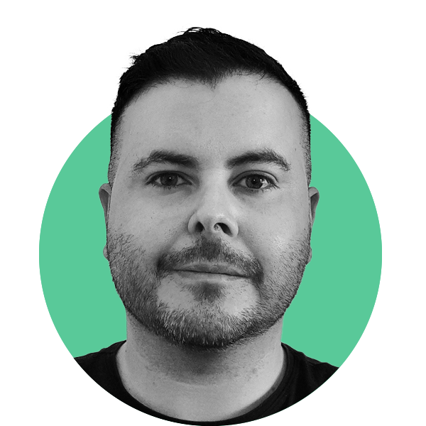

# Edgardo Saracho

<!DOCTYPE html>
<html lang="en">
<head>
    <meta charset="UTF-8">
    <title>Divs Flotantes</title>
    
</head>
<body>
    

        <!-- Div izquierdo con texto y botón -->
        

            
Licenciado en Diseño Industrial - Producto de la Escuela Universitaria Centro de Diseño (EUCD). Técnico Terciario en Diseño Gráfico egresado de la Escuela Comunicación Social.

            
Actualmente me desempeño como docente G°1 en las asignaturas Identidad visual (EUCD), Taller de diseño transversal (LDCV) y en Género y comunicación visual (LDCV), dentro de la FADU. También cuento con una marca propia de diseño de interfaces para relojes digitales.

            
He trabajado como diseñador en varias empresas, por lo que tengo experiencia en desarrollo de identidades corporativas, papelería, piezas publicitarias, banners, diseño editorial, ilustración, presentación de productos, desarrollo web y mobile, UI & UX.

            
Me gusta el diseño en general, investigar y aprender cosas nuevas. Soy autodidacta y busco seguir creciendo como profesional.

            <button onclick="window.location.href='https://www.behance.net/edg_uy'" target="_blank">Portfolio</button>
        

        

            </img>
        

    

</body>
</html>

