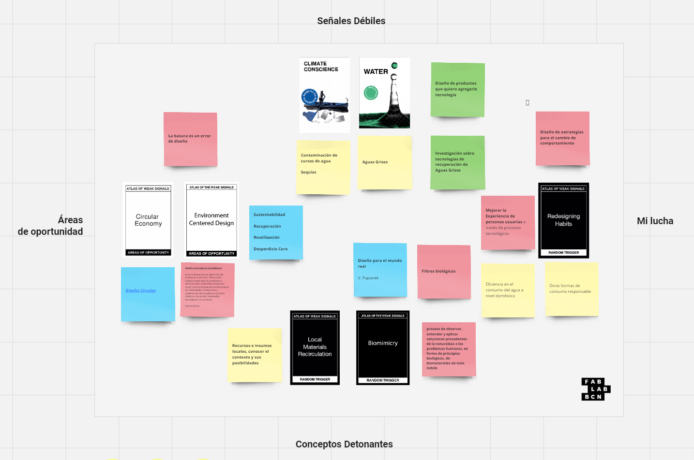
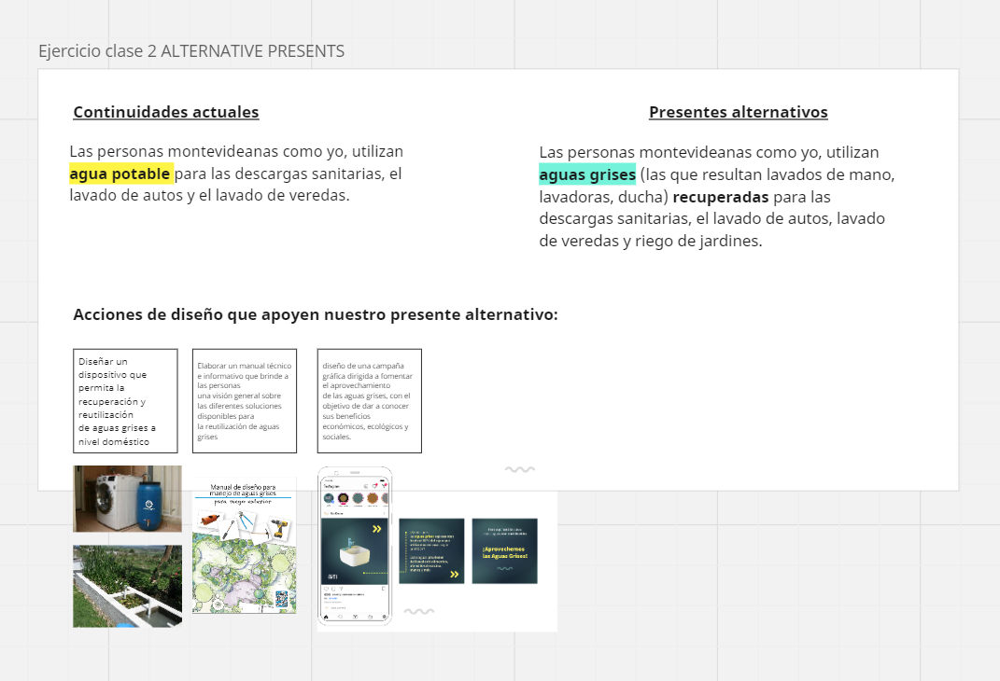
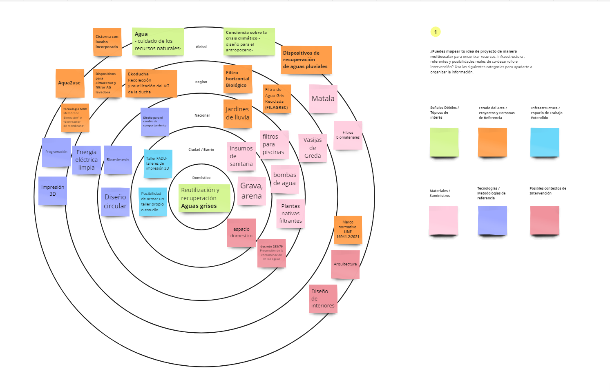

---
hide:
    - toc
---

# MD01 - Proyecto y contexto

## 01.  El Atlas de las Señales Débiles

En la primera sesión del módulo de diseño, comenzamos explorando una  herramienta interesante conocida como El Atlas de las Señales Débiles, la cual se facilita a través de la plataforma Miro. Este recurso se compone de un juego de cartas dividido en Señales Débiles, Áreas de Oportunidades y Disparadores Aleatorios. Por cada concepto abordado, se eligen dos cartas de las primeras categorías mencionadas y, finalmente, una última carta que simboliza el desafío, una acción que consideramos fundamental en cada proyecto.

“ El Atlas de las Señales Débiles es un conjunto de herramientas diseñado por Mariana Quintero, que transforma la investigación de señales débiles en un espacio práctico para navegar y comprender posibles escenarios emergentes basados ​​en las tendencias subyacentes de nuestro mundo actual. Es un ejercicio que facilita la búsqueda de oportunidades, amenazas, desafíos y visiones compartidas para la innovación, la formulación de políticas, la intervención, la investigación y las oportunidades de negocios en el futuro.” (Fab Lab Barcelona, 2022).

**Señales débiles**

Indicación de un problema emergente o señal temprana de un cambio que puede ser significativo en el futuro. 

_Climate conciencie_
_Design for the Athropocene_

Opté por seleccionar la carta "_Climate Conscious Design for the Anthropocene_" del mazo, ya que es innegable que la crisis climática actual requiere acciones que abarquen desde pequeñas intervenciones hasta grandes cambios estructurales. En este contexto, el diseño puede desempeñar un papel crucial al ofrecer soluciones proyectuales o proponer metodologías que promuevan una economía circular. Como afirmó el diseñador Víctor Papanek (1977: 21), "el diseño se ha convertido en la herramienta más poderosa que utiliza el ser humano para moldear sus utensilios y su entorno (y, por ende, la sociedad y a sí mismo)".

Generar conciencia sobre la crisis climática es esencial, y el diseño de productos destinados a proteger los recursos se vuelve fundamental en este proceso.

La Organización Panamericana de la Salud (2022) advierte que el cambio climático representa la mayor amenaza para la salud mundial en el siglo XXI. Este fenómeno afecta directamente la salud a través de eventos climáticos extremos como olas de calor, sequías y tormentas intensas, así como indirectamente mediante enfermedades respiratorias, transmisión de enfermedades por vectores, inseguridad alimentaria y del agua, desnutrición y desplazamientos forzados.

Al profundizar en el tema del Antropoceno, descubrí un artículo académico titulado "Antropoceno y diseño" de Clarisa Menteguiaga, que presenta casos de estudio que abordan el desarrollo de productos para mitigar algunos de los problemas asociados con esta era geológica. El término "Antropoceno" fue acuñado por el biólogo Eugene F. Stoermer y popularizado por el premio Nobel de Química, Paul Crutzen, para describir la época en la que las actividades humanas comenzaron a tener un impacto significativo en el medio ambiente a escala global (Issberner y Léna, 2018).

_Water_ 
_Design for the care of natural resources_

        <!-- Div izquierdo con texto y botón -->
        

            
Las temáticas presentes en el mazo de cartas de señales débiles no coincidían con el enfoque de mi investigación. Por esta razón, decidí crear una nueva carta con una temática que considero vital: Agua, el diseño para el cuidado de los recursos naturales. En la actualidad, enfrentamos una emergencia ambiental en la que la calidad del suelo, del aire y del agua está en riesgo. Uno de los problemas más críticos es el manejo del agua, un recurso fundamental que se ve afectado por la crisis climática y la contaminación, y que se utiliza cada vez más en la refrigeración de servidores y en la producción industrial. Si no se toman medidas adecuadas, el agua, que ahora se cotiza en bolsa, podría convertirse en un recurso de lujo debido a su agotamiento. En mi opinión, es imperativo prohibir el uso del agua potable para fines no esenciales, y fomentar en su lugar el uso de aguas recicladas y de segundo uso. Esto requiere el desarrollo de tecnologías innovadoras y un diseño comprometido con la preservación de nuestros recursos naturales.

        

        

                </img>
        

    

**Áreas de oportunidad**

En mi comprensión, las áreas de oportunidad se refieren a procesos o metodologías proyectuales que brindan una guía o punto de partida para generar propuestas de diseño que sean pertinentes a las señales débiles identificadas.

_Economía Circular_

Considero que diseñar dentro de una economía circular debe ser una prioridad. Reducir los desperdicios y gestionar eficientemente los recursos son aspectos esenciales en este enfoque. Por ello, concuerdo plenamente con la afirmación de que "la basura es un error de diseño", lo cual nos recuerda la importancia de tener en cuenta el ciclo de vida completo de un producto en todo momento.

_Diseño Centrado en el Medio Ambiente_

        <!-- Div izquierdo con texto y botón -->
        

            
Asimismo, he creado otra carta para enriquecer el mazo: el diseño centrado en el ambiente. Este enfoque está intrínsecamente relacionado con la preservación de los recursos naturales y nos brinda una perspectiva renovada sobre cómo abordar los problemas ambientales actuales. Al considerar a las personas como parte integral de un sistema en lugar de como el centro, podemos identificar problemáticas que quizás pasan desapercibidas en la rutina diaria, pero que a largo plazo podrían ser beneficiosas de abordar, como la contaminación del aire o la presencia de microplásticos.

            
"El diseño centrado en el medio ambiente es un enfoque para el desarrollo de productos o servicios que busca su sostenibilidad ambiental, social y económica al priorizar las necesidades, limitaciones y preferencias de la audiencia humana objetivo, así como las partes interesadas estratégicas no humanas" (Sznel, 2020).

        

        

                </img>
        

    

    
**Conceptos detonantes**

En relación a los conceptos detonantes, opté por incluir la "Circulación de Materiales Locales" porque considero fundamental aprovechar los recursos disponibles en nuestro entorno. Además, cada producto importado conlleva una huella de carbono, lo cual contradice los principios de sustentabilidad.

        <!-- Div izquierdo con texto y botón -->
        

            
La otra carta que decidí agregar es la de "Biomímesis". Creo firmemente en la sabiduría de la naturaleza y en la importancia de observar cómo resuelve problemas. En mi caso, me enfoco en los filtros de agua y me inspira estudiar los procesos naturales de biofiltrado presentes en la flora y fauna, especialmente en las especies nativas.

        

        

                </img>
        

    

**Mi lucha**
_Redesigning habits_

El rediseño de hábitos y costumbres arraigadas, que rara vez son cuestionadas, representa una oportunidad para fomentar transiciones hacia comportamientos más sostenibles con el medio ambiente. Considero que el desarrollo de productos puede desempeñar un papel crucial en este proceso al ofrecer alternativas que faciliten dichas transiciones. Un ejemplo claro de esto es el cambio de un hábito tan arraigado como utilizar agua potable para las descargas sanitarias a utilizar aguas grises. Este simple cambio de hábito puede traducirse en un ahorro significativo de agua y ejemplifica cómo el diseño puede impulsar cambios positivos en la forma en que interactuamos con nuestro entorno.

## 02. Alternativas presentes

Este punto me pareció interesante verlo como otra forma de presentar el objetivo general y los objetivos específicos de un proyecto, haciéndome partícipe de la problemática.

Las personas montevideanas como yo, utilizan **agua potable** para las descargas sanitarias, el lavado de autos y el lavado de veredas.

Las personas montevideanas como yo, utilizan **aguas grises** (las que resultan lavados de mano, lavadoras, ducha) recuperadas para las descargas sanitarias, el lavado de autos, lavado de veredas y riego de jardines.

**Acciones de diseño que apoyen nuestro presente alternativo:**
- Diseñar un dispositivo que permita la recuperación y reutilización de aguas grises a nivel doméstico
- Elaborar un manual técnico e informativo que brinde a las personas una visión general sobre las diferentes soluciones disponibles para la reutilización de aguas grises.
- Diseño de una campaña gráfica dirigida a fomentar el aprovechamiento de las aguas grises, con el objetivo de dar a conocer sus beneficios económicos, ecológicos y sociales.

## 03. Espacio de Diseño multiescalar

Mi experiencia previa con un proyecto centrado en la recuperación de aguas grises me facilitó la comprensión y aplicación de varios de los conceptos presentados en la herramienta, lo que me permitió apropiarme de ella con facilidad. Además, percibí que esta herramienta me brindó nuevas perspectivas sobre cómo abordar mi proyecto. Durante mi formación como diseñador, siempre se me inculcó la importancia de adoptar un enfoque transdisciplinario y de no limitarme a ser parte de un grupo de usuarios específico. Aunque siempre me he esforzado por empatizar, especialmente durante las etapas de resolución ergonómica, y preguntarme: ¿Qué haría yo si fuera el usuario, el fabricante, el comprador o el operario de mantenimiento? 

Considero que la herramienta es una fuente de creatividad dinámica que facilita la presentación visual de un proyecto de manera efectiva.

 <button class="custom-button" onclick="window.open('https://miro.com/app/board/uXjVKQD2e9Y=/', '_blank')">Panel Miro</button>

## _First person perspective_

Durante la clase, surgió en mí una reflexión que va más allá de simplemente reconocer la importancia del uso del agua: ¿cómo puedo documentar mis propios hábitos relacionados con su consumo para contribuir al proceso de diseño? Mi propuesta consiste en dedicar las próximas 24 horas a utilizar exclusivamente aguas grises generadas por la lavadora, provenientes de un solo ciclo de lavado de 15 minutos que produce aproximadamente 30 litros de agua. Pretendo utilizar esta agua para las descargas sanitarias durante el día, con la hipótesis de que alcanzará para aproximadamente 5 descargas, dado que la capacidad mínima de las cisternas es de 6 litros. El siguiente paso sería llevar a cabo este seguimiento a lo largo de todo el mes para evaluar con precisión la viabilidad y el impacto de este cambio de hábito en mi consumo de agua.

**Documentos consultados**

Organización Panamericana de la salud OPS. Cambio climático y salud. 
<https://www.paho.org/es/temas/cambio-climatico-salud />. [Consulta: 22-4-2024].

Fab Lab Barcelona. (2022). Atlas of Weak Signals.<https://fablabbcn.org/blog/emergent-ideas/atlas-of-weak-signals/>. [Consulta: 22-4-2024].

Equipo IDA Ideas Digitales Aplicadas. (2020). ¿Qué es el diseño centrado en el medio ambiente? Blog IDA Ideas Digitales Aplicadas. <https://blog.ida.cl/diseno/diseno-centrado-en-el-medio-ambiente/>. [Consulta: 22-4-2024].

Menteguiaga, C. (2020/2021). Antropoceno y diseño. En Cuaderno 103, pp. 131-143. Centro de Estudios en Diseño y Comunicación. 

Rojas, Marynes  (Anfitrión). (2019-presente). “Diseño circular” [Podcast]. Spotify. <https://open.spotify.com/episode/5YHEGB3aVLwe5ocAmGpUZ2>.

Sznel, M. (2020). The time for environment-centered design has come. Medium. <https://medium.com/user-experience-design-1/the-time-for-environment-centered-design-has-come-770123c8cc61/>. [Consulta: 22-4-2024].

