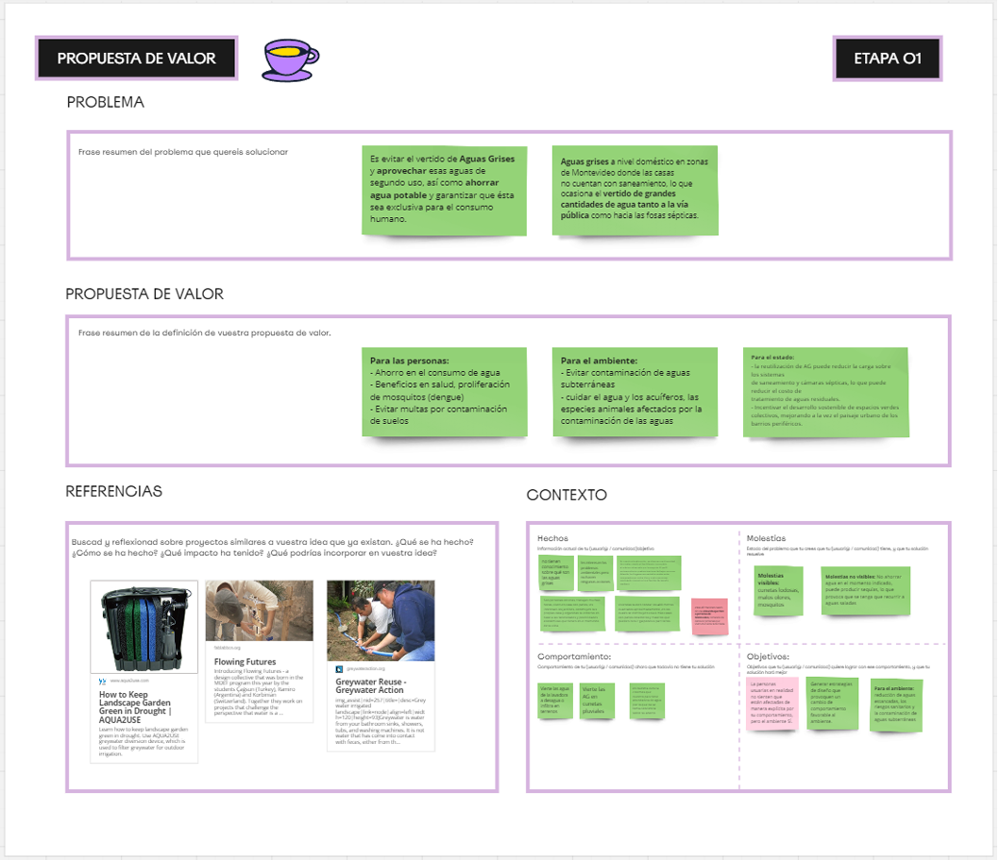
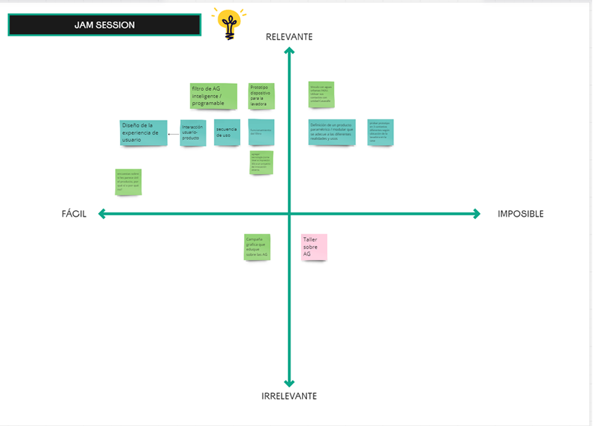
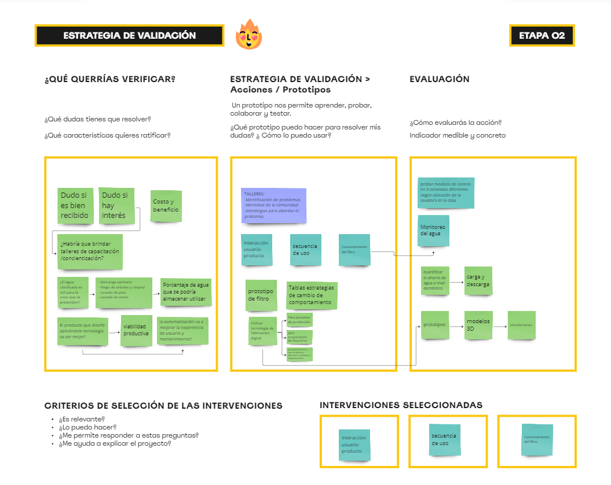

# MD01 - Proyecto y diseño

En el módulo de diseño, se abordaron varios aspectos esenciales para la estructuración y validación del proyecto, prescindiendo de definiciones teóricas de diseño y metodologías clásicas, así como de ciertos conceptos técnicos del glosario asociado a la disciplina. En su lugar, se enfocó en herramientas prácticas que facilitarán la conceptualización y la ejecución del proyecto.

## Propuesta de Valor

#### Para las Personas

1. **Ahorro en el Consumo de Agua** Al reutilizar las aguas grises, se reduce significativamente el consumo de agua potable.
2. **Beneficios en Salud** Disminuye la proliferación de mosquitos y otros vectores de enfermedades, como el dengue.
3. **Prevención de Multas** Se evita la imposición de multas por la contaminación del suelo debido al vertido inadecuado de aguas residuales.

#### Para el Medio Ambiente

1. **Prevención de la Contaminación de Aguas Subterráneas**: El tratamiento y reutilización de aguas grises reduce la contaminación de acuíferos y aguas subterráneas.
2. **Conservación de Recursos Hídricos**: Se protege el agua y los acuíferos, beneficiando a las especies animales afectadas por la contaminación de las aguas.

#### Para el Estado

1. **Reducción de la Carga sobre los Sistemas de Saneamiento** La reutilización de aguas grises disminuye la presión sobre los sistemas de saneamiento y cámaras sépticas, reduciendo así los costos asociados al tratamiento de aguas residuales.
2. **Promoción del Desarrollo Sostenible** Incentiva la creación de espacios verdes colectivos y mejora el paisaje urbano en los barrios periféricos, contribuyendo al desarrollo sostenible de la comunidad.

### Referencias Utilizadas

1. **Filtro de Agua Doméstico**: Se trata de un sistema que clarifica y permite la reutilización de aguas grises. Este sistema recoge el agua de los lavabos y lavadoras, la filtra a través de múltiples filtros que pueden ser limpiados y reutilizados, y luego permite su uso seguro para el riego exterior. Es una solución práctica y ecológica, que se conecta a una salida de 220 volts y está automatizada con un Smart Controller. La bomba incorporada facilita la conexión al sistema de riego, y el mantenimiento es mínimo, requiriendo limpieza cada dos meses.

2. **Flowing Futures**: Un producto que utiliza filtros de piedras y plantas filtrantes para recuperar y recircular aguas grises, ofreciendo una solución innovadora y sostenible similar a la idea de este proyecto.

3. **Manual de Gray Water Action**: Un manual técnico que presenta diversos dispositivos para la reutilización de aguas grises, proporcionando una guía detallada para implementar soluciones efectivas en la gestión de aguas residuales domésticas.

## 2. Acciones para Validar el Proyecto (Jam Session)
El segundo canvas, denominado "Jam Session", se centró en las acciones necesarias para validar el proyecto. Estas acciones incluyen: prototipos del filtro, estrategias de cambio de comportamiento y experiencia de usuario.

## 3. Idea del Proyecto y Estrategias de Validación
El tercer canvas presenta la idea del proyecto y las estrategias para validar las acciones seleccionadas:
Descripción del Proyecto: Dispositivo inteligente que recupere, clarifique y almacene un porcentaje de AG producidas por la lavadora

Estrategias de Validación:
Medición de Resultados: funcionamiento del filtro y experiencia de usuario
Análisis de Impacto: Evaluación del impacto en el ahorro de Agua
Feedback Continuo: Uso de encuestas y entrevistas para obtener retroalimentación continua y ajustar el sistema según las necesidades de los usuarios.
Escalabilidad: Planificación para la expansión del proyecto a otras áreas de Montevideo y potencialmente a otras ciudades con problemas similares.

## Reflexión 

Para mí, el diseño es una disciplina metódica e iterativa que tiene como objetivo identificar y solucionar problemas de interacción entre las personas y su entorno. A lo largo del desarrollo de este proyecto, he podido experimentar de primera mano cómo la implementación de herramientas y estrategias interdisciplinares ha sido fundamental para alcanzar los objetivos.

El uso de los canvas me ha permitido estructurar de manera clara y concisa las propuestas de valor, las acciones de validación y las estrategias para la ejecución del proyecto. Estas herramientas han facilitado la organización y priorización de las tareas, así como la identificación de los beneficios clave para diferentes grupos de interés: las personas, el medio ambiente y el estado. La visualización de estos elementos en los canvas ha sido esencial para comunicar de manera efectiva el propósito y el alcance del proyecto a todos los involucrados.

Desde mi perspectiva, el diseño integra de manera armoniosa las funciones práctica, estética y simbólica, tal como lo describe Lobach. En este proyecto, esta armonía se refleja en la solución práctica que ofrece el sistema de filtración de aguas grises, en la estética de un entorno más verde y limpio, y en el simbolismo de un compromiso con la sostenibilidad y la mejora de la calidad de vida.

La metodología que he seguido ha sido iterativa, permitiéndome realizar ajustes continuos basados en la retroalimentación y los resultados obtenidos en cada fase. Esta iteración no solo ha mejorado la eficacia del proyecto, sino que también ha asegurado que las soluciones propuestas sean adecuadas y beneficiosas para la comunidad específica de Montevideo en la que se implementarán.

En conclusión, las herramientas de diseño que he empleado no solo han sido útiles para la estructuración y validación del proyecto, sino que también han demostrado la importancia de un enfoque interdisciplinar y metódico. Este enfoque garantiza que las soluciones sean prácticas, estéticamente agradables y simbólicamente significativas, contribuyendo así a un diseño que no solo resuelve problemas, sino que también mejora la interacción de las personas con su entorno de manera sostenible y significativa.

