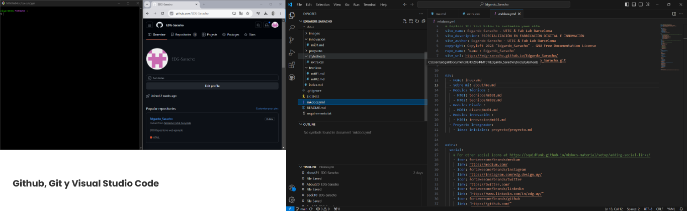

---
hide:
    - toc
---

# MI01

## 1. Github, Git y Visual Studio Code

En este paso, seguí meticulosamente los tutoriales de la plataforma. Me tomé el tiempo necesario y apliqué un consejo valioso que aprendí en mi experiencia en desarrollo web: siempre trabajar con una doble pantalla. Esto facilita la comparación de los screenshots del tutorial con lo que ocurre en el programa en uso. Aunque encontré algunos errores que no logré registrar de inmediato, pude identificarlos rápidamente gracias a esta comparación visual.

Opté por utilizar Visual Studio Code, un programa con el que ya contaba con experiencia previa en desarrollo y maquetación web. Su interfaz gráfica me resultó familiar y me ayudó a recordar el proceso de trabajo. Al principio, me familiaricé con la plantilla y el lenguaje de programación, revisando las páginas y realizando pequeños cambios al azar para observar sus efectos. Esto me llevó a realizar casi 200 commits. Posteriormente, organicé mi proceso y planifiqué cómo quería que se visualizara la página personal, incorporando mi propia identidad.
