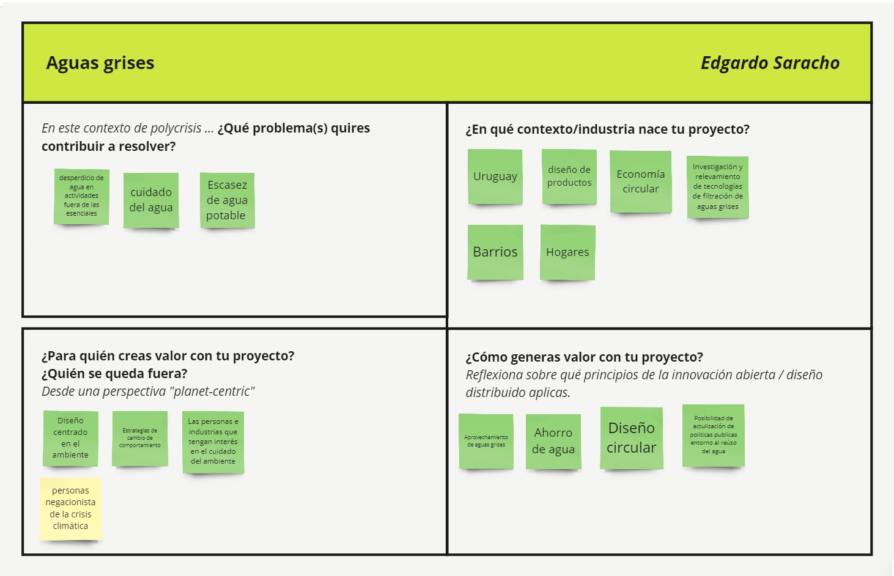
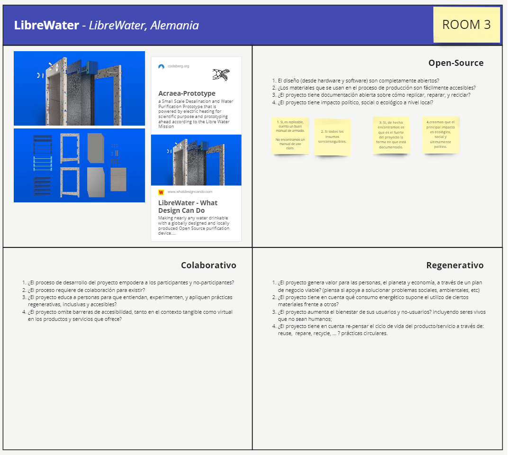

---
hide:
    - toc
---

# MI01

##Diseño Distribuido e Innovación Abierta

**Ejercicio 1 - innovación abierta**

El objetivo era conceptualizar el proyecto en el que estamos trabajando dentro del marco de la innovación abierta, considerando el qué, por qué, para qué, para quién y en qué contexto se desarrolla. En mi caso, continúo con la temática abordada en el módulo de diseño, aplicando los conceptos previamente trabajados.

Para responder a estas preguntas, me baso en un proyecto de diseño con un trasfondo social y ecológico, creado para beneficiar a comunidades específicas en la periferia de Montevideo. Este proyecto es parte de mi trabajo final de grado realizado en 2023. El producto filtra, recupera y almacena aguas grises vertidas en cunetas pluviales. Adjunto una imagen representativa y el proyecto completo está disponible en la plataforma Colibrí. 

[Saracho Vaz, E. (2023.). Dispositivo para la recuperación y reutilización de aguas grises evitando su vertido en cunetas pluviales. Tesis de grado. Universidad de la República (Uruguay). Facultad de Arquitectura, Diseño y Urbanismo.](https://www.colibri.udelar.edu.uy/jspui/handle/20.500.12008/42447)

**En este contexto de polycrisis... ¿Qué problema(s) quieres contribuir a resolver?**

La escasez de agua nos impulsa a proyectar nuevas formas de cuidar este valioso recurso. Entre estas propuestas, destacan los diseños que fomentan el ahorro y la recuperación de aguas grises (AG), que pueden ser reutilizadas de manera eficiente.

**¿En qué contexto/industria nace tu proyecto?**

El proyecto surge en el ámbito académico, donde desarrollé una propuesta basada en una problemática observada en barrios de la periferia de Montevideo, Uruguay. La iniciativa consiste en diseñar productos específicamente enfocados en abordar esta problemática.

**¿Para quién creas valor con tu proyecto?**
**¿Quién se queda fuera?** **Desde una perspectiva "planet-centric"*

El valor de este proyecto radica en su contribución al medio ambiente, la preservación de los recursos naturales y la mejora de la salud de las personas.

**¿Cómo generas valor con tu proyecto?**
**Reflexiona sobre qué principios de la innovación abierta / diseño distribuido aplicas.*

Genero valor con mi proyecto aplicando los principios de innovación abierta y diseño distribuido. El proyecto se desarrolla en colaboración con la comunidad, asegurando que las soluciones propuestas respondan directamente a sus necesidades específicas. Al ser de código abierto, permite que cualquier persona pueda adaptarlo según sus propias necesidades y capacidades constructivas, así como la frecuencia de producción de aguas grises. Esto no solo promueve la inclusión y la participación comunitaria, sino que también facilita la escalabilidad y la replicabilidad de la solución en diferentes contextos.

----------------------

**Ejercicio 2**

En este ejercicio, partimos de un caso de estudio en el cual, utilizando la información disponible en la web y los recursos proporcionados, debemos responder las preguntas que aparecen en el recuadro. Elegí este equipo porque la temática del agua me resulta cercana y quería profundizar en su contenido.

Las conclusiones a las que llegamos con el equipo indican que el proyecto cumple con varios de los criterios establecidos, destacando especialmente por su sólida documentación, la cual facilita su replicación, y su enfoque colaborativo y abierto. Sin embargo, identificamos áreas de mejora en la explicación de su contexto de uso y en la eficiencia del proceso de filtración, desalinización y potabilización del agua en relación con el tiempo y los recursos empleados.

-----------------------

**Diseño regenerativo**

Uno de los conceptos que me pareció novedoso y que actualiza los procesos de diseño es el de diseño regenerativo. Estaba acostumbrado a hablar de diseño sostenible, un término muy amplio, pero el diseño regenerativo se enfoca más en los cambios actuales de paradigmas. Este concepto implica algo positivo, algo que se va generando como un tejido vivo. Me resulta interesante porque presenta valores que ya tenía arraigados en mis proyectos anteriores y en los que deseo continuar.
El diseño regenerativo implica impactos positivos para la ecología, la salud y la sociedad, lo cual es fundamental para mí. Pretendo seguir desarrollando productos basados en principios de sostenibilidad y circularidad, pero que vayan un paso más allá, centrándose en restaurar y reponer los recursos naturales en lugar de simplemente minimizar los daños o maximizar la eficiencia.
Además, el diseño regenerativo introduce una metodología que agregué en el módulo de diseño: la biomímesis, que consiste en aprender de los procesos naturales y poder reproducirlos.

**Conclusión**
La perspectiva de la innovación abierta me resultó particularmente interesante como una forma de colaborar con diferentes actores y en diversos contextos. Esta metodología permite abrir múltiples caminos para que los proyectos puedan ser continuados y enriquecidos. Considero también saludable no estar obsesionado con la posibilidad de que tu proyecto sea robado o ser excesivamente celoso con los propios procesos. En cambio, ser transparente desde el principio y mostrar al mundo las capacidades que uno tiene como profesional puede ser el punto de partida para proyectos aún mejores.

Recomiendo el siguiente artículo, ya que la mayoría de los casos de estudio comienzan con la investigación de un material y las posibilidades de diseño que ofrece:

Bak-Andersen, Mette. 2018. “Cuando la materia conduce a la forma: el diseño guiado por el material (MDD, Material Driven Design) y la sostenibilidad” [When matter leads to form: Material-driven design for sustainability]. Temes de disseny 34: 10-31.
