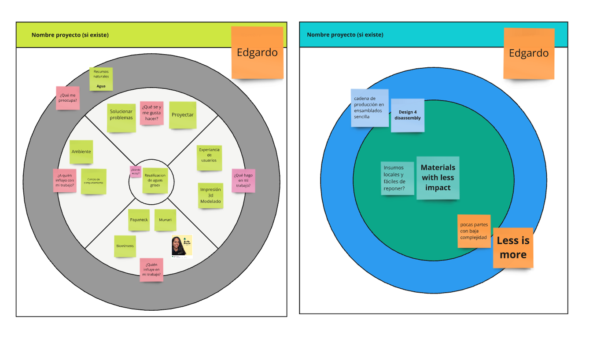
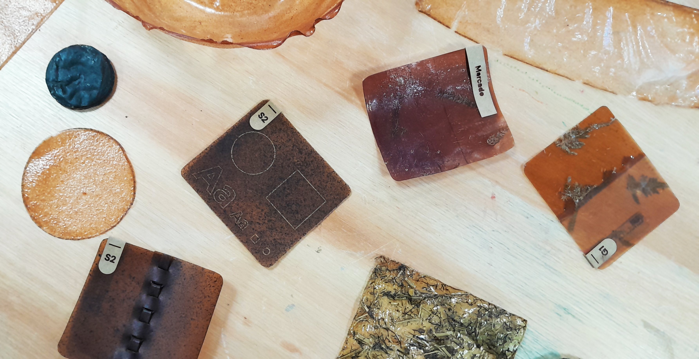
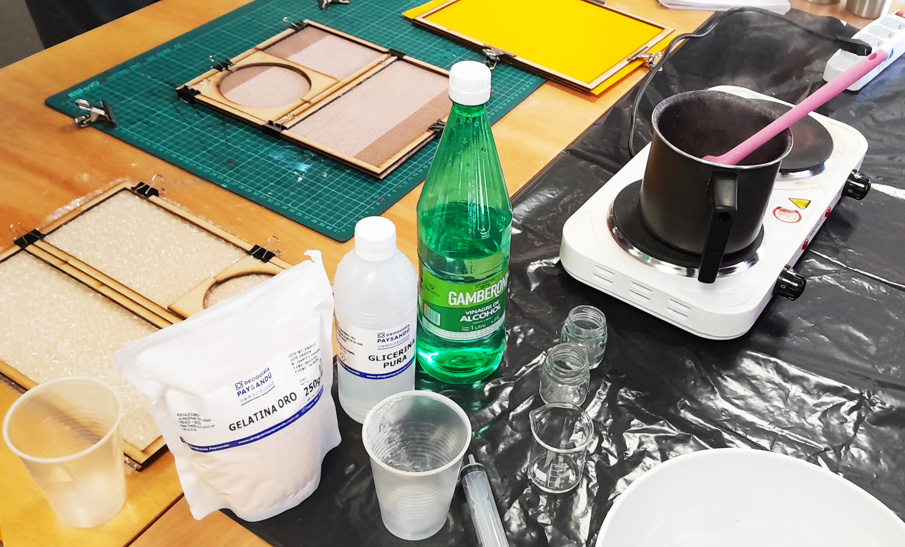
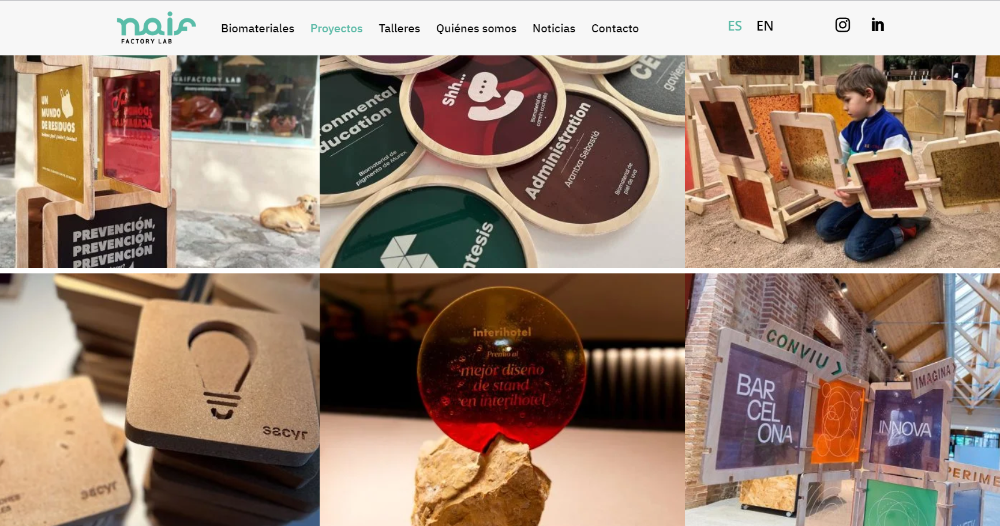

---
hide:
    - toc
---

# MI01
## Desarrollo sostenible y economía circular 

El propósito de este módulo es proporcionar herramientas y ejemplos prácticos para aplicar los principios de la economía circular en proyectos sostenibles, promoviendo un enfoque más consciente y eficiente en el uso de los recursos.

Durante la formación, utilizamos una herramienta que nos permitió realizar un mapeo integral de nuestro proyecto, evaluando en qué medida se alinea con los principios fundamentales de la economía circular. Estos principios incluyen la optimización de recursos, la reducción de desperdicios y la reutilización de materiales, elementos clave para garantizar la sostenibilidad a largo plazo.

En cuanto a la sostenibilidad de mi proyecto, el color que mejor refleja su estado actual es un verde claro, ya que está orientado hacia el uso de materiales locales y la reutilización de aguas grises. Sin embargo, mi objetivo a futuro es alcanzar un verde más intenso, simbolizando el uso de materiales que generen el menor impacto ambiental posible. Además, el celeste, que representa el "Design for Disassembly", es un componente importante de mi enfoque, ya que permite que los componentes del producto sean fácilmente desmontables y reemplazables, minimizando el desperdicio. El naranja, que representa el principio de "Less is More", orienta mi proceso hacia la simplificación del flujo productivo, reduciendo la necesidad de insumos innecesarios.

Mis "acciones circulares" están alineadas con estos cuatro principios clave: el diseño para el desmontaje (celeste), la optimización de recursos mediante la simplicidad (naranja), el uso de materiales con menor impacto (verde) y un enfoque de pensamiento sistémico basado en el valor (lila). Al centrarme en estos "Hotspots", busco generar el mayor impacto en la sostenibilidad, transformando la mentalidad de "es más barato comprar uno nuevo" hacia una cultura de productos duraderos, reparables y respetuosos con el medio ambiente.

Finalmente, el análisis de los círculos de influencia destaca que el contexto local, especialmente la disponibilidad de materiales en ferreterías y tiendas sanitarias, juega un papel clave en el éxito de este enfoque. Garantizar que los insumos sean accesibles no solo facilita la producción, sino que también contribuye directamente al cuidado de los recursos y al impacto positivo en la sostenibilidad del agua, que es el eje central de mi proyecto.

## Biomateriales aplicados al diseño de productos

Los biomateriales son una opción innovadora y sostenible en el diseño de productos, ya que permiten utilizar recursos renovables y biodegradables en lugar de materiales convencionales. Estos materiales no solo reducen el impacto ambiental, sino que también ofrecen nuevas posibilidades creativas para diseñadores y fabricantes.

El viernes 6 de septiembre, participé en un taller de producción de biomateriales en el Espacio Ciencia del LATU. Fue una experiencia muy interesante que me permitió experimentar de primera mano cómo se pueden producir estos materiales. Desde la perspectiva de la experimentación, lo encontré bastante accesible, ya que los instrumentos e insumos necesarios son relativamente fáciles de conseguir en droguerías locales.

Durante el evento, también tuvimos la oportunidad de escuchar a un diseñador que trabaja con biomateriales, lo que me permitió conocer casos prácticos muy interesantes. Uno de los ejemplos que más me impactó fue el uso de láminas de gelatina para crear soportes gráficos, grabados con láser, que vimos en el taller. Este enfoque combina sostenibilidad con técnicas de fabricación avanzadas, lo cual me pareció sumamente inspirador.

En resumen, el taller no solo me brindó la oportunidad de ver de cerca cómo se producen biomateriales, sino también de comprender los procesos y visualizar posibles aplicaciones para mi propio proyecto. La experiencia me motivó a experimentar con estos materiales en el desarrollo de soluciones sostenibles, abriendo nuevas oportunidades para integrar biomateriales en mi diseño. 

sitio de Naifactory Lab: [naifactorylab.com](https://naifactorylab.com/proyectos/).

