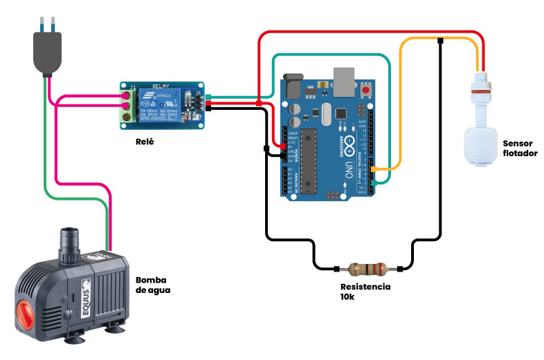
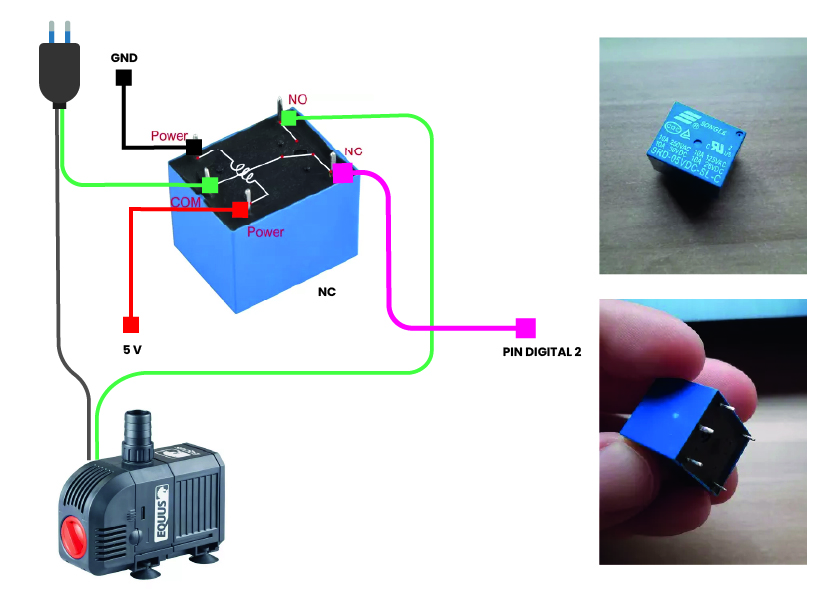
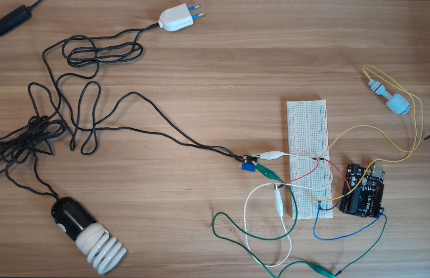
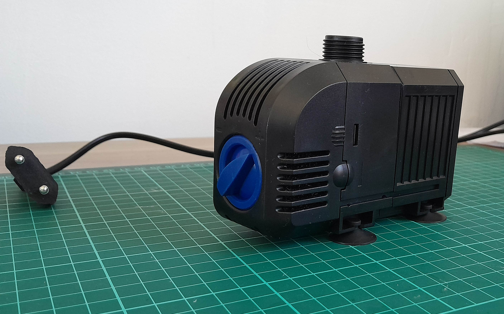
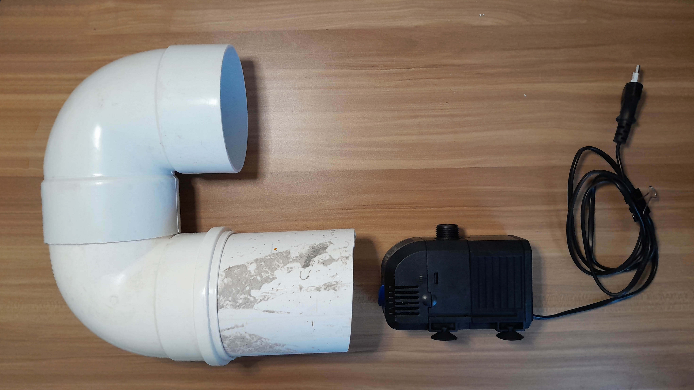

 

## **Introducción**

El desafío principal en el desarrollo de mi prototipo fue la automatización del proceso de almacenamiento y distribución de agua. En versiones previas, este proceso se realizaba de forma mecánica. Sin embargo, en este proyecto, la incorporación de componentes electrónicos permitirá automatizar el almacenamiento de agua y su distribución, con posibles aplicaciones como el llenado de cisternas o un sistema de riego por goteo, según las características de la vivienda.

## **Esquema de Funcionamiento**

Durante la etapa de investigación, analicé diversas estrategias para llevar a cabo esta automatización y determiné la necesidad de una bomba de agua que fuera económica, compacta y lo suficientemente potente para garantizar la distribución eficiente del agua. Además, identifiqué la importancia de un sistema de control para el encendido y apagado automático, para lo cual un sensor de flotador resultó ser una opción viable. Realicé consultas a través de ChatGPT para obtener información sobre cómo construir el circuito, aunque estas consultas no resultaron suficientes para aclarar completamente el proceso.

## **Conexión y Diseño del Circuito**

En una sesión de consulta con Eduardo Chamorro, arquitecto e investigador que brinda tutorías, me ayudó a definir el esquema de conexión y determinar los componentes necesarios. Eduardo proporcionó un esquema inicial que sirvió de base para el desarrollo del proyecto.

Procedí a adquirir los materiales faltantes y enfrenté algunos inconvenientes, en particular con la obtención del relé mostrado en el esquema. Utilicé un relé de 5 pines incluido en mi kit de Arduino, lo que generó dificultades al integrarlo en el esquema propuesto por Eduardo. Gracias a la colaboración de Santi Fuentemilla, con quien intercambié tutoriales e información, logramos investigar alternativas; sin embargo, persistía la incertidumbre respecto al correcto funcionamiento del relé en este contexto.

### Código

<pre><code>
// constants won't change. They're used here to set pin numbers:
const int buttonPin = 5;  // the number of the pushbutton pin
const int ledPin = 2;    // the number of the LED pin

// variables will change:
int buttonState = 0;  // variable for reading the pushbutton status

void setup() {
  // initialize the LED pin as an output:
  pinMode(ledPin, OUTPUT);
  // initialize the pushbutton pin as an input:
  pinMode(buttonPin, INPUT);
}

void loop() {
  // read the state of the pushbutton value:
  buttonState = digitalRead(buttonPin);

  // check if the pushbutton is pressed. If it is, the buttonState is HIGH:
  if (buttonState == HIGH) {
    // turn LED on:
    digitalWrite(ledPin, HIGH);
  } else {
    // turn LED off:
    digitalWrite(ledPin, LOW);
  }
}
</code></pre>

## **Prueba de Viabilidad de las Conexiones**

Antes de usar la bomba de agua nueva, decidí realizar una prueba de viabilidad utilizando una lámpara conectada a la red eléctrica. Este ensayo utiliza el mismo esquema de conexión y permite verificar la funcionalidad del circuito sin riesgo de dañar la bomba. Esta medida de precaución garantiza que las conexiones estén bien configuradas antes de realizar el prototipo.

### **Ensayo con Lámpara de Luz**

Finalmente, tras varios intentos, logré conseguir en el mercado local un relé de 6 pines que me permitió conectarlo de acuerdo con el esquema original. Realicé una prueba utilizando una lámpara para verificar el funcionamiento del circuito.

Aspectos pendientes incluyen definir cómo se alimentará la placa una vez completado el prototipo y, posiblemente, agregar en el código un retraso (delay) en el apagado para evitar un corte abrupto de energía.

----------

## **Bomba de Agua**

Consegí una bomba de agua de 25W, ideal para fuentes, estanques, peceras e hidroponía. Su tamaño y potencia resultan adecuados para los requerimientos de este proyecto, permitiendo una distribución eficiente de agua.

La intención es colocar la bomba dentro de uno de los tubos del sistema, aprovechando sus dimensiones que permiten un ajuste firme y seguro dentro del tubo, sin necesidad de adicionales para su fijación. Sin embargo, un desafío será cortar el cable de la bomba para realizar las conexiones electrónicas necesarias, garantizando tanto la seguridad como la funcionalidad del dispositivo en el prototipo.

En la imagen adjunta, se muestra una prueba preliminar de funcionamiento. Coloqué la bomba en un balde con agua no potable y conecté una manguera de aproximadamente 2 metros de longitud, utilizándola a potencia media. El sistema funcionó perfectamente, manteniendo un flujo constante y estable de agua, lo que confirma la viabilidad de la bomba para este proyecto.

