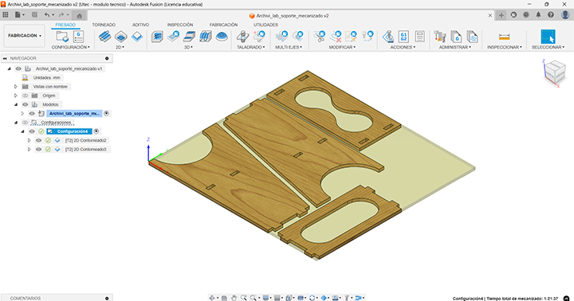
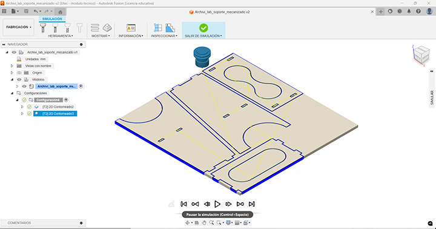
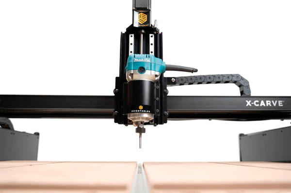

## **Introducción**

El prototipo incluye piezas diseñadas específicamente para ser cortadas en CNC, lo que permitió optimizar su estructura para facilitar el ensamblaje y crear formas circulares capaces de sostener elementos clave del diseño.  

Las piezas fueron fabricadas en OSB, un material que considero interesante debido a su resistencia a la humedad y su capacidad para integrarse estéticamente con PVC, un material común en la construcción. Esta combinación aporta una estética coherente y funcional al prototipo.  

## Software Utilizado  
Para realizar los cortes, preparé los archivos en dos formatos principales: 

- **Archivos para mecanizado en Fusion 360:** Estos permiten generar trayectorias precisas y configurar parámetros como profundidades de corte, velocidades de avance y tipos de herramientas. Este flujo de trabajo asegura una alta compatibilidad con las máquinas CNC y garantiza la precisión en proyectos complejos. 

- **Archivos compatibles con software vectorial:** Exporté los diseños en formato SVG, facilitando su uso en software especializado que permite ajustar configuraciones básicas de corte, como trazos, profundidades y tamaños. Esta opción resulta ideal para proyectos más sencillos o para quienes trabajan con programas que soportan archivos vectoriales. 

Esta versatilidad asegura que los archivos sean accesibles y adaptables a diferentes flujos de trabajo según las herramientas disponibles.   

## Proceso de Corte  
El router utilizado fue una **X-Carve**, y con el apoyo de Joaquín (docente), organizamos todas las piezas del diseño en un único archivo, lo que permitió optimizar el uso de una sola placa de OSB.  
La herramienta de corte empleada fue una broca de **⅛ de pulgada**, seleccionada por su precisión en detalles y capacidad para trabajar con OSB.  

Finalmente, se generó un archivo G-code desde un software de diseño paramétrico para asegurar la compatibilidad con la máquina y la precisión del corte. Este flujo de trabajo resultó eficiente y adaptable a las necesidades del prototipo.  

## Problemas y Soluciones  
Durante la fabricación, surgieron inconvenientes con los espacios de encastre de las piezas cortadas. Los ajustes no quedaron correctamente dimensionados, lo que me obligó a realizar modificaciones manuales para presentar el prototipo a tiempo. Debido a las limitaciones de tiempo, no fue posible realizar otra prueba en el laboratorio antes de la entrega.  

Para solucionar este problema a largo plazo, ajusté los archivos digitales modificando las holguras para optimizar el encastre. Además, los círculos diseñados para fijar componentes también quedan algo justos, lo que generó dificultades adicionales durante el ensamblaje. 

## Archivos Disponibles  
Como parte del proyecto, generé los archivos vectoriales y el G-code necesarios para el corte en CNC. Estos archivos están disponibles para su descarga, facilitando la reproducción del diseño o futuras modificaciones por parte de otros usuarios interesados.  

**[Descargar GCODE](<../Descargas/PROYECTO FINAL/mecanizado_soporte.nc>)**

**[Descargar SVG](<../Descargas/PROYECTO FINAL/Soporte_dibujo_EDGARDO.svg>)**
