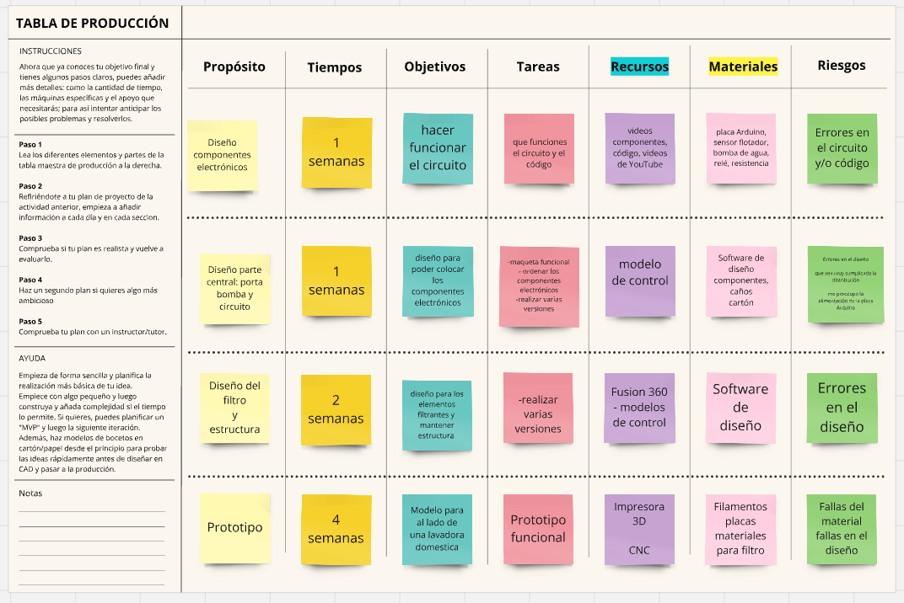
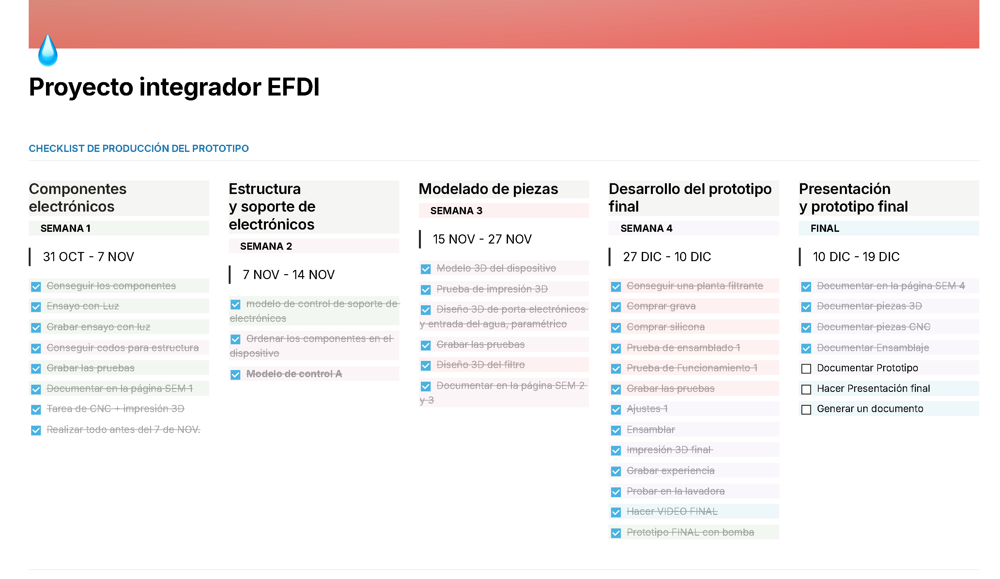
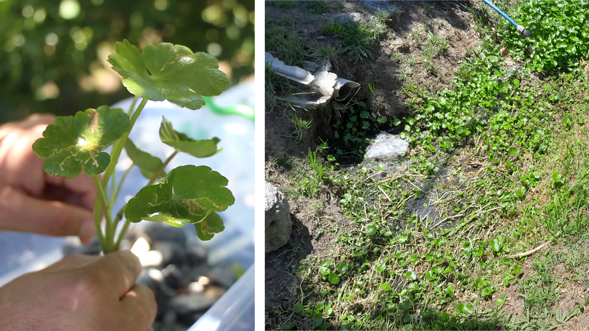
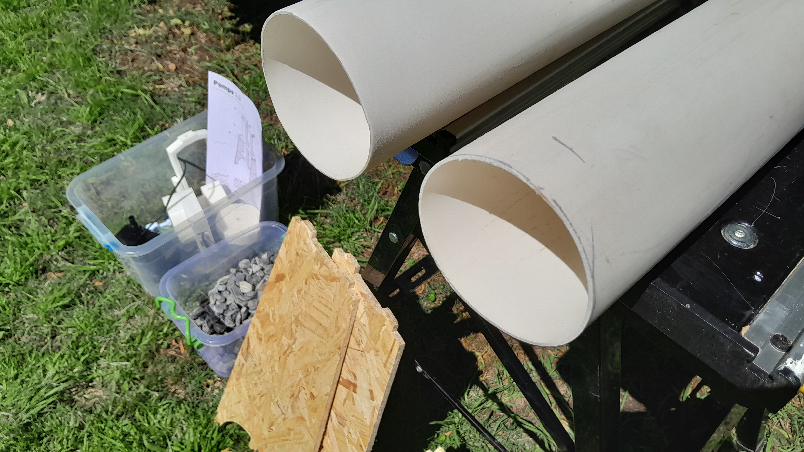
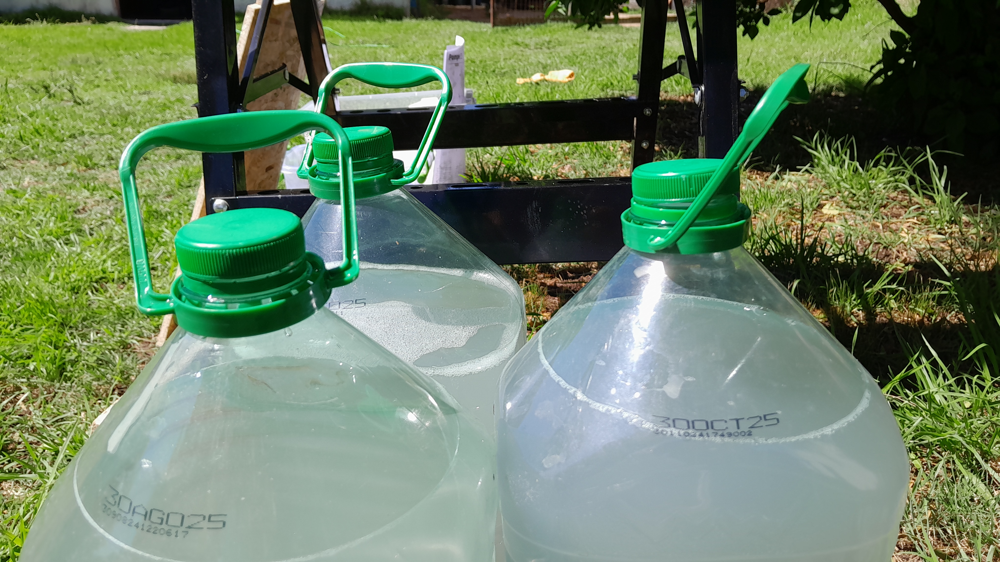
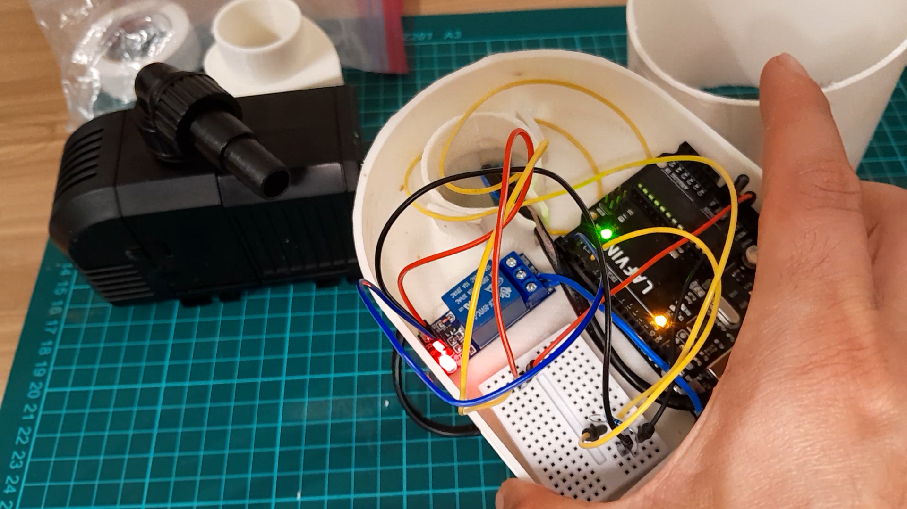
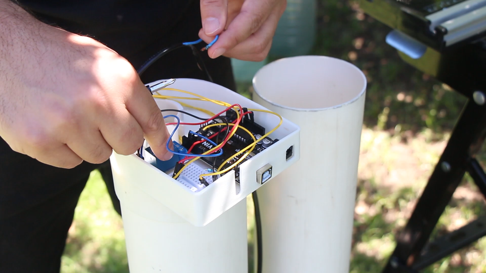
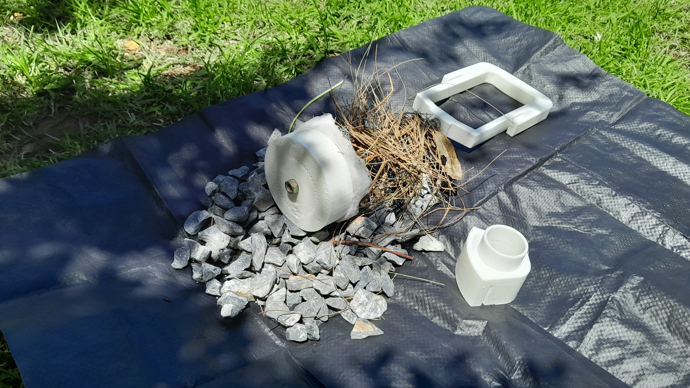

## Introducción

En esta página presento el proceso de ensamblaje del prototipo, junto con una lista de insumos detallada, incluyendo sus precios en el mercado local. Muchos de los componentes se adquirieron a través de plataformas como Mercado Libre.

## Organización y Planeamiento

Para gestionar el desarrollo del proyecto, utilicé diferentes herramientas que me ayudaron a organizar el trabajo y cumplir con los plazos establecidos:  

- **Tabla de Producción:** Implementada en el curso para desglosar las tareas y materiales necesarios para cada etapa del proceso.  

- **Notion:** Utilicé esta herramienta para centralizar toda la información del proyecto y diseñar un diagrama de Gantt personalizado. Este diagrama fue fundamental para planificar y visualizar las fases del proyecto, asegurando que las actividades clave se completaran dentro de los tiempos previstos.  

El uso combinado de estas herramientas no solo facilitó el seguimiento del proyecto, sino que también permitió identificar prioridades y ajustar tareas según los avances y contratiempos.

## Lista de Insumos 

Las piezas **ruteadas** e **impresas en 3D** fueron producidas en los laboratorios de fabricación digital de la **UTEC**. Por este motivo, no tengo información precisa sobre sus costos, lo que representa un aspecto a investigar en el futuro para evaluar la viabilidad económica de la producción en otros contextos.

A continuación, se detalla la lista de materiales utilizados para el prototipo, junto con sus precios aproximados en el mercado local:

<table>
        <thead>
            <tr>
                <th>Insumos</th>
                <th>Cantidad</th>
                <th>Precio ($)</th>
            </tr>
        </thead>
        <tbody>
            <tr>
                <td>Bomba de agua</td>
                <td>1</td>
                <td>1090</td>
            </tr>
            <tr>
                <td>codo 100 H-H</td>
                <td>1</td>
                <td>280</td>
            </tr>
            <tr>
                <td>codo 100 H-M</td>
                <td>1</td>
                <td>280</td>
            </tr>
            <tr>
                <td>Piedra gris</td>
                <td>1</td>
                <td>146</td>
            </tr>
            <tr>
                <td>Caño</td>
                <td>1</td>
                <td>480</td>
            </tr>
            <tr>
                <td>Pegamento para PVC</td>
                <td>1</td>
                <td>100</td>
            </tr>
            <tr>
                <td>Sensor nivel de agua</td>
                <td>1</td>
                <td>120</td>
            </tr>
            <tr>
                <td>Relé 5V</td>
                <td>1</td>
                <td>100</td>
            </tr>
            <tr>
                <td>Resistencia</td>
                <td>1</td>
                <td>50</td>
            </tr>
            <tr>
                <td>Dupont-cables Para Arduino 10 Unidades</td>
                <td>1</td>
                <td>70</td>
            </tr>
             <tr>
                <td>Varilla Roscada Zinc 8mm Rosca 1.25 X 1mt</td>
                <td>1</td>
                <td>126</td>
            </tr>
             <tr>
                <td>"Tuerca Acero Inox 8mm Rosca 1.25 Pack </td>
                <td>25</td>
                <td>260</td>
            </tr>
            <tr>
                <td>Placa arduino</td>
                <td>1</td>
                <td>620</td>
            </tr>
            <tr class="total">
                <td>TOTAL</td>
                <td></td>
                <td>3722</td>
            </tr>
            <tr class="total">
                <td>Precio del Euro</td>
                <td></td>
                <td>47</td>
            </tr>
            <tr class="total">
                <td>Total en Euro</td>
                <td></td>
                <td>79.19</td>
            </tr>
        </tbody>
</table>

## Selección de la especie vegetal para el prototipo

Para el prototipo seleccioné la *Hydrocotyle bonariensis*, conocida comúnmente como muñequita de agua o **redondita de agua**, una planta herbácea nativa que crece en cunetas pluviales. Durante mi observación, noté que en las áreas donde prospera esta especie no se produce eutrofización ni acumulación de suelos lodosos, lo cual es un indicador positivo de su impacto en el entorno.

Además de sus propiedades funcionales, la Redondita de agua pertenece a la flora local, crece en abundancia y presenta una estética atractiva, factores que me parecieron apropiados para incorporarla en el diseño del prototipo.

## Pruebas y Ensayos

### Video Pruebas y Ensamblaje

<iframe width="688" height="388"
src="https://www.youtube.com/embed/yK3vQS_ltQw?si=NwHAIi9ug4bTfs48" title="YouTube video player" frameborder="0" allow="accelerometer; autoplay; clipboard-write; encrypted-media; gyroscope; picture-in-picture; web-share" referrerpolicy="strict-origin-when-cross-origin" allowfullscreen></iframe>

### Prueba del Prototipo con Agua

Para validar el funcionamiento del prototipo, realicé una prueba utilizando 18 litros de aguas grises (equivalentes a tres bidones de agua de 6 litros cada uno). Con esta cantidad de agua, logré poner en marcha la bomba de agua sin inconvenientes, comprobando que el sistema era capaz de activar y controlar el flujo como se esperaba.

Sin embargo, al realizar la prueba en la lavadora, el caudal de agua resultó ser demasiado alto, lo que generó un exceso de flujo para el sistema de drenaje de la máquina. Este comportamiento estaba previsto dentro de los parámetros del proyecto, ya que, para un rendimiento óptimo en aplicaciones como la lavadora, es necesario integrar más módulos que permitan gestionar un mayor volumen de agua y regular el caudal de forma más eficiente.

## Pruebas de la bomba y el circuito eléctrico

### Video Elementos Electrónicos -  Revisión y Funcionamiento

<iframe width="688" height="388" src="https://www.youtube.com/embed/tXCWXE0Mv1I?si=Fgz6USPgP67xK3Jz" title="YouTube video player" frameborder="0" allow="accelerometer; autoplay; clipboard-write; encrypted-media; gyroscope; picture-in-picture; web-share" referrerpolicy="strict-origin-when-cross-origin" allowfullscreen></iframe>

## Mantenimiento del filtro y evaluación de su funcionalidad.

### Video Filtro - Revisión y Mantenimiento

Para realizar el mantenimiento del filtro, primero se separan las plantas y se retiran las piedras utilizando el agarre, colocándolas sobre una lona o dentro de un balde para facilitar el proceso. Luego, se retiran el mulch y el algodón, separándolos cuidadosamente. El mulch puede devolverse a la tierra junto con los posibles lodos, aprovechándolos como nutrientes orgánicos. La barrera filtrante se limpia cuidadosamente, verificando que no haya obstrucciones. Finalmente, las piedras se limpian o sacuden antes de ser reinstaladas en el filtro.

<iframe width="688" height="388" src="https://www.youtube.com/embed/liEHHCGcEvI?si=gCaeRS-BRB4Jcq4X" title="YouTube video player" frameborder="0" allow="accelerometer; autoplay; clipboard-write; encrypted-media; gyroscope; picture-in-picture; web-share" referrerpolicy="strict-origin-when-cross-origin" allowfullscreen></iframe>

