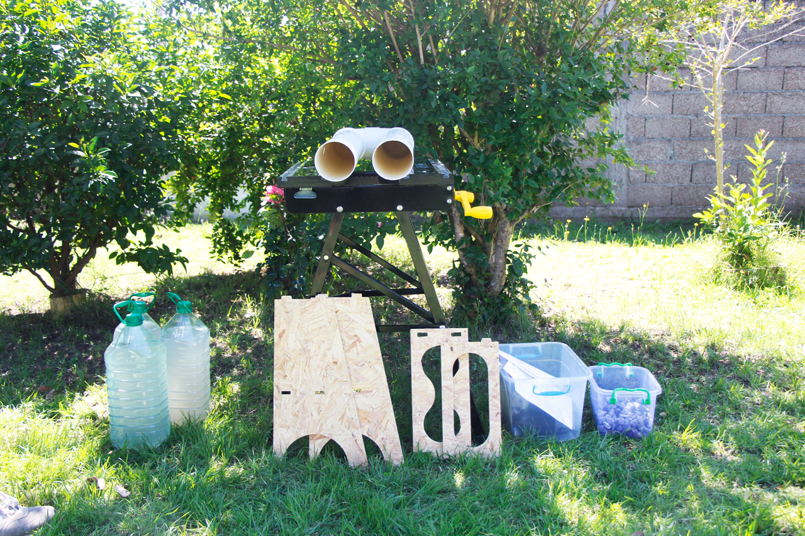
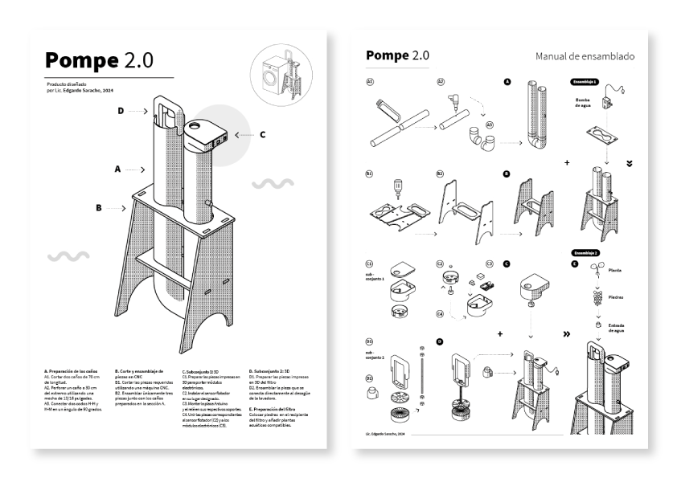
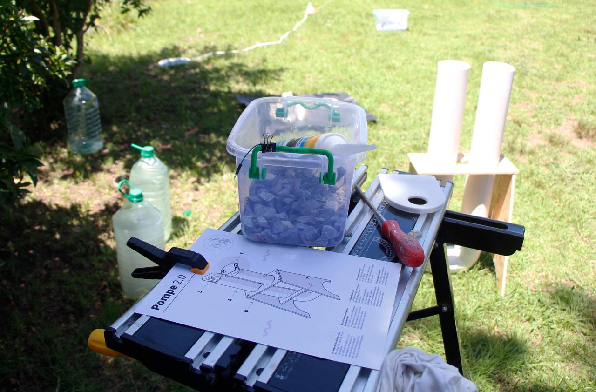

## Introducción

En esta página presento el proceso de ensamblaje del prototipo, junto con una lista de insumos detallada, incluyendo sus precios en el mercado local. Muchos de los componentes se adquirieron a través de plataformas como Mercado Libre.

Las piezas **ruteadas** e **impresas en 3D** fueron producidas en los laboratorios de fabricación digital de la **UTEC**. Por este motivo, no tengo información precisa sobre sus costos, lo que representa un aspecto a investigar en el futuro para evaluar la viabilidad económica de la producción en otros contextos.

### Lista de Insumos 
A continuación, se detalla la lista de materiales utilizados para el prototipo, junto con sus precios aproximados en el mercado local:

<table>
        <thead>
            <tr>
                <th>Insumos</th>
                <th>Cantidad</th>
                <th>Precio ($)</th>
            </tr>
        </thead>
        <tbody>
            <tr>
                <td>Bomba de agua</td>
                <td>1</td>
                <td>1090</td>
            </tr>
            <tr>
                <td>codo 100 H-H</td>
                <td>1</td>
                <td>280</td>
            </tr>
            <tr>
                <td>codo 100 H-M</td>
                <td>1</td>
                <td>280</td>
            </tr>
            <tr>
                <td>Piedra gris</td>
                <td>1</td>
                <td>146</td>
            </tr>
            <tr>
                <td>Caño</td>
                <td>1</td>
                <td>480</td>
            </tr>
            <tr>
                <td>Pegamento para PVC</td>
                <td>1</td>
                <td>100</td>
            </tr>
            <tr>
                <td>Sensor nivel de agua</td>
                <td>1</td>
                <td>120</td>
            </tr>
            <tr>
                <td>Relé 5V</td>
                <td>1</td>
                <td>100</td>
            </tr>
            <tr>
                <td>Resistencia</td>
                <td>1</td>
                <td>50</td>
            </tr>
            <tr>
                <td>Dupont-cables Para Arduino 10 Unidades</td>
                <td>1</td>
                <td>70</td>
            </tr>
             <tr>
                <td>Varilla Roscada Zinc 8mm Rosca 1.25 X 1mt</td>
                <td>1</td>
                <td>126</td>
            </tr>
             <tr>
                <td>"Tuerca Acero Inox 8mm Rosca 1.25 Pack </td>
                <td>25</td>
                <td>260</td>
            </tr>
            <tr>
                <td>Placa arduino</td>
                <td>1</td>
                <td>620</td>
            </tr>
            <tr class="total">
                <td>TOTAL</td>
                <td></td>
                <td>3722</td>
            </tr>
            <tr class="total">
                <td>Precio del Euro</td>
                <td></td>
                <td>47</td>
            </tr>
            <tr class="total">
                <td>Total en Euro</td>
                <td></td>
                <td>79.19</td>
            </tr>
        </tbody>
</table>

Como parte del desarrollo, elaboré un **manual de ensamblaje** basado en el flujo productivo. Opté por hacerlo básico y altamente iconográfico para facilitar su comprensión. En futuras iteraciones, me gustaría crear una versión más desarrollada y compacta, ideal como formato de bolsillo. Puedes descargar el manual desde el siguiente enlace:  

[**Descargar Manual de Ensamblaje**](<../Descargas/PROYECTO FINAL/FLUJO_PRODUCTIVO_POMPE.pdf>)

## Pruebas y Ensayos

En el video adjunto se muestran algunas de las pruebas y ensayos realizados antes de ensamblar el prototipo final. Estas incluyen:  
- **Pruebas de la bomba y el circuito eléctrico.**  
- **Mantenimiento del filtro y evaluación de su funcionalidad.**  
Estos pasos fueron fundamentales para asegurar la viabilidad y el correcto funcionamiento del sistema.

<iframe width="688" height="388"
src="https://www.youtube.com/embed/yK3vQS_ltQw?si=NwHAIi9ug4bTfs48" title="YouTube video player" frameborder="0" allow="accelerometer; autoplay; clipboard-write; encrypted-media; gyroscope; picture-in-picture; web-share" referrerpolicy="strict-origin-when-cross-origin" allowfullscreen></iframe>

