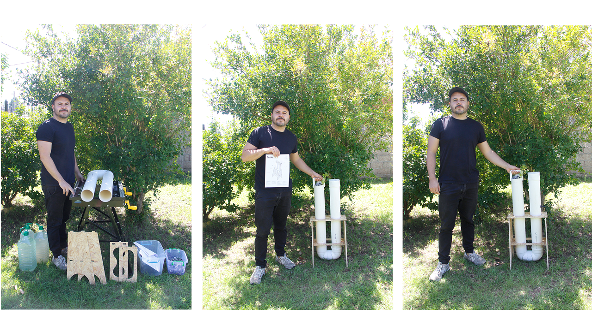

## Pompe 2.0
En esta página presento algunas fotos del prototipo final y dejo disponible para su descarga la presentación final, el modelado en Fusion 360 del prototipo y las conclusiones.

## Dispositivo

## Archivos Descargables

1. 📥 **Modelo 3D en Fusion 360**  
[Descargar archivo Fusion 360](ruta/archivo_fusion.f3d)  

2. 📥 **Presentación final del proyecto**  
[Descargar presentación](ruta/presentacion_final.pdf) 

## Conclusiones

A lo largo del curso, he aprendido diversas metodologías de diseño, como la 1PP, el diseño regenerativo y el diseño abierto, entre otras. Estas metodologías han ampliado mi visión del diseño, resaltando su alcance social y colaborativo. Además, pude mejorar mis habilidades en diseño digital y fabricación digital, lo que enriqueció un proyecto previo. Esto me permitió responder a la pregunta que me planteé al inicio del año: **¿Es posible mejorar la funcionalidad y automatización de mi proyecto (Aguas grises) utilizando herramientas de fabricación digital como impresión 3D, corte láser o CNC?** La respuesta fue afirmativa, lo cual me generó gran satisfacción.
Las herramientas de fabricación digital desempeñaron un papel clave en la optimización del proyecto, permitiéndome no solo mejorar su funcionalidad, sino también explorar nuevas posibilidades de diseño e innovación. Estoy muy satisfecho con los resultados obtenidos, lo que me ha motivado a seguir aplicando estos conocimientos en futuros proyectos y continuar con el desarrollo de este proyecto final.

