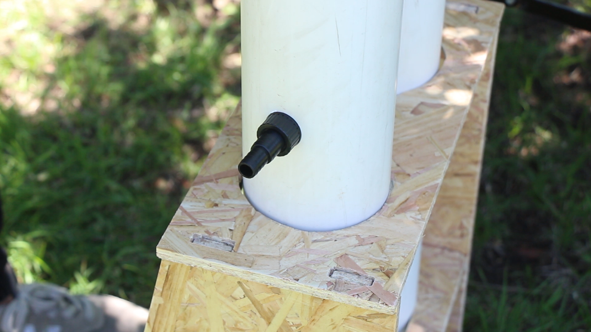
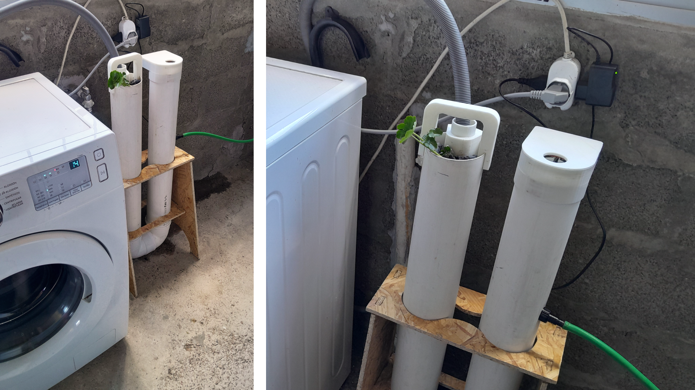

## Pompe 2.0
En esta página presento algunas fotos del prototipo final y dejo disponible para su descarga la presentación final, el modelado en Fusion 360 del prototipo y las conclusiones.

## Dispositivo

## Video

<iframe width="688" height="388" src="https://www.youtube.com/embed/8UGYwvOUGKc?si=hJAnl--X82mQ9_XY" title="YouTube video player" frameborder="0" allow="accelerometer; autoplay; clipboard-write; encrypted-media; gyroscope; picture-in-picture; web-share" referrerpolicy="strict-origin-when-cross-origin" allowfullscreen></iframe>

## Manual de ensamblaje

Como parte del desarrollo, elaboré un **manual de ensamblaje** basado en el flujo productivo. Opté por hacerlo básico y altamente iconográfico para facilitar su comprensión. En futuras iteraciones, me gustaría crear una versión más desarrollada y compacta, ideal como formato de bolsillo. 

## Archivos Descargables

1. **Modelo 3D en Fusion 360**  
[Descargar archivo Fusion 360](ruta/archivo_fusion.f3d)  

2. **Manual de Ensamblaje**  
[Descargar Manual de Ensamblaje](<../Descargas/PROYECTO FINAL/FLUJO_PRODUCTIVO_POMPE.pdf>)

3. **Presentación final del proyecto**  
[Descargar presentación](ruta/presentacion_final.pdf) 

## Futuras iteraciones

En las iteraciones futuras del proyecto, me gustaría probar con más módulos para poder manejar caudales mayores y mejorar la eficiencia del sistema. También planeo integrar sensores adicionales para optimizar el funcionamiento general. Será necesario adaptar la estructura para acomodar una mayor cantidad de módulos y asegurar la estabilidad del dispositivo. Además, me gustaría incorporar un sistema de monitoreo de calidad del agua, que permita evaluar constantemente el estado del agua tratada. Otro aspecto en el que quiero trabajar es en la interacción entre las personas y el objeto, buscando hacerla más fluida e intuitiva. Por último, realizar una validación con otras personas para obtener retroalimentación y ajustar el diseño según las necesidades y expectativas de los usuarios.

## Conclusiones

A lo largo del curso, he aprendido diversas metodologías de diseño, como la 1PP, el diseño regenerativo y el diseño abierto, entre otras. Estas metodologías han ampliado mi visión del diseño, resaltando su alcance social y colaborativo. Además, pude mejorar mis habilidades en diseño digital y fabricación digital, lo que enriqueció un proyecto previo. Esto me permitió responder a la pregunta que me planteé al inicio del año: **¿Es posible mejorar la funcionalidad y automatización de mi proyecto (Aguas grises) utilizando herramientas de fabricación digital como impresión 3D, corte láser o CNC?** La respuesta fue afirmativa, lo cual me generó gran satisfacción.

Las herramientas de fabricación digital desempeñaron un papel clave en la optimización del proyecto, permitiéndome no solo mejorar su funcionalidad, sino también explorar nuevas posibilidades de diseño e innovación. Estoy muy satisfecho con los resultados obtenidos, lo que me ha motivado a seguir aplicando estos conocimientos en futuros proyectos y continuar con el desarrollo de este proyecto final y seguir investigando en electrónica.

