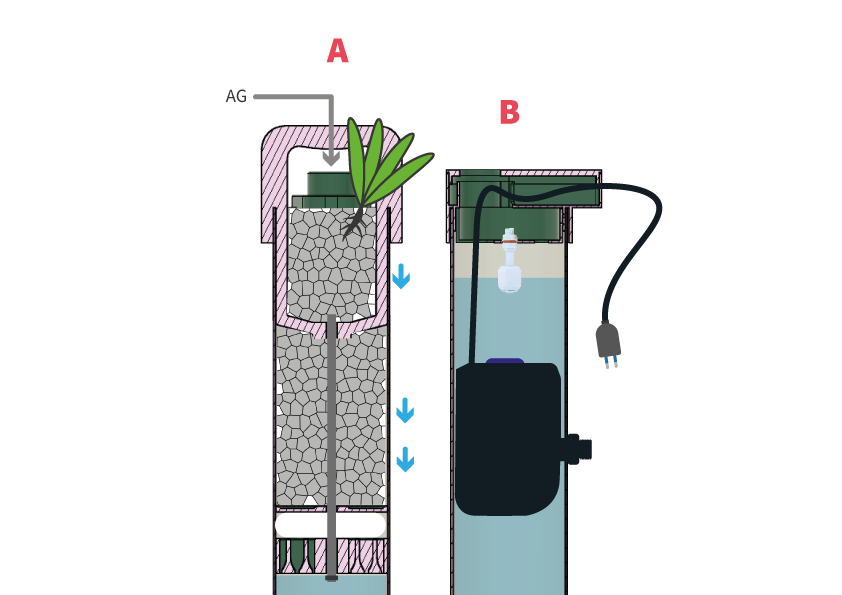

---
hide:
    - toc
---

# AGUAS GRISES

## Introducción al Proyecto

Este proyecto surge de un enfoque de diseño abierto, iniciado como mi trabajo final de carrera en 2023, el cual fue presentado y documentado con el objetivo de ser replicable. La problemática abordada se encuentra en los barrios periféricos de Montevideo, donde muchos hogares carecen de conexión al sistema de saneamiento, enfrentándose a riesgos sanitarios y ambientales por el manejo inadecuado de aguas grises (AG).

Las aguas grises (AG) son aquellas provenientes de actividades domésticas como el lavado de alimentos, utensilios de cocina, manos, duchas y superficies en general. Representan aproximadamente el 60% del agua consumida en los hogares, según datos de la Unidad Reguladora de Servicios de Energía y Agua (URSEA). Estas aguas, al no contener residuos de inodoros, tienen un potencial significativo para ser tratadas y reutilizadas, lo que contribuye a una gestión más eficiente de los recursos hídricos y a la reducción del impacto ambiental.

Siendo parte de esta comunidad, por residir en la periferia de Montevideo, diseñé el proyecto con un entendimiento directo de las necesidades locales y los desafíos específicos que enfrentan las personas en esta situación. Además, utilicé la metodología de first person perspective, que me permitió pensar como usuario, poniendo el foco en la experiencia y las necesidades prácticas, lo que enriqueció el proceso de diseño.

Para abordar esta problemática, se implementaron tecnologías como la electrónica, la impresión 3D y el ruteado de placas de OSB, combinando fabricación digital con materiales locales y económicos. Este enfoque distribuye la capacidad de producción a nivel comunitario y prioriza la sostenibilidad, promoviendo el ahorro de recursos hídricos y la reducción de impactos ambientales.
El proyecto busca no solo resolver un problema técnico, sino también generar un modelo inclusivo y replicable que fomente la innovación local, el cuidado del medioambiente y la mejora en la calidad de vida.

**[Panel Miro - Proyecto](https://miro.com/app/board/uXjVKAVYfr8=/)**

**[Tabla de producción](https://miro.com/app/board/uXjVKlm1tIk=/)**

## Metodología proyectual

Para presentar el proyecto, utilizo la metodología proyectual que Bruno Munari describe en su libro "Cómo nacen los objetos". Personalmente, considero esta metodología una forma ordenada y simple de resumir las etapas por las que he transitado en el desarrollo del proyecto. En la siguiente tabla, resumo las diferentes etapas.

<table>
  <thead>
    <tr>
      <th><strong>Pasos</strong></th>
      <th><strong>Definiciones según Munari</strong></th>
      <th><strong>Proyecto</strong></th>
    </tr>
  </thead>
  <tbody>
    <tr>
      <td><strong>1. Problema</strong></td>
      <td><em>Identificación general del problema a resolver.</em></td>
      <td>Aguas Grises (AG)</td>
    </tr>
    <tr>
      <td><strong>2. Definición del problema</strong></td>
      <td><em>Descripción clara y precisa del problema, incluyendo sus limitaciones y alcance.</em></td>
      <td>Las AG en Uruguay, provenientes del lavado de ropa, duchas y lavabos, se descargan sin tratamiento, contaminando aguas. Este desperdicio podría reutilizarse para riego y descargas no potables, pero se enfrenta a restricciones normativas domésticas.</td>
    </tr>
    <tr>
      <td><strong>3. Elementos del problema</strong></td>
      <td><em>Descomposición del problema en elementos más específicos.</em></td>
      <td> aguas grises, contaminación, saneamiento, recuperación, sustentabilidad, ambiente, recursos naturales, consumo sustentable, diseño, riego, descargas sanitarias</td>
    </tr>
    <tr>
      <td><strong>4. Recopilación de datos</strong></td>
      <td><em>Recolección de información relevante relacionada con el problema.</em></td>
      <td> Datos están todos en mi trabajo final de carrera:
Saracho Vaz, E. (2023.). Dispositivo para la recuperación y reutilización de aguas grises evitando su vertido en cunetas pluviales. Tesis de grado. Universidad de la República (Uruguay). Facultad de Arquitectura, Diseño y Urbanismo.</td>
    </tr>
    <tr>
      <td><strong>5. Análisis de datos</strong></td>
      <td><em>Examen detallado de la información recogida para entender mejor el problema.</em></td>
      <td> Antecedentes más destacados cercanos a la problemática y posibles soluciones:
- filtros de piedras y plantas filtrantes para recuperar y recircular aguas grises
- manual técnico que presenta diversos dispositivos para la reutilización
- sistema recoge el agua de los lavabos y lavadoras, la filtra a través de múltiples filtros que pueden ser limpiados y reutilizados, y luego permite su uso seguro para el riego exterior</td>
    </tr>
    <tr>
      <td><strong>6. Creatividad</strong></td>
      <td><em>Generación de ideas y soluciones posibles, utilizando técnicas creativas.</em></td>
      <td> ¿Es posible mejorar la funcionalidad y automatización de <b>Pompe</b> utilizando herramientas de fabricación digital como impresión 3D, corte láser o CNC? 
      Dispositivo inteligente que recupere, clarifique y almacene un porcentaje de AG producidas por la lavadora</td>
    </tr>
    <tr>
      <td><strong>7. Materiales y tecnologías</strong></td>
      <td><em>Selección de materiales y tecnologías adecuadas para las posibles soluciones.</em></td>
      <td>Impresión 3D de un filtro de AG 
Sistema inteligente de sensores, bomba de agua y placa arduino
Combinación de biofiltros y filtros físicos (grava y totora)
Caños sanitarios de PVC
estructura que sostenga antihumedad, cortada con router
</td>
    </tr>
    <tr>
      <td><strong>8. Experimentación</strong></td>
      <td><em>Pruebas y ensayos para verificar la viabilidad de las ideas propuestas.</em></td>
      <td>1. Componentes electrónicos  
2. Primer modelo de control 
3. Piezas impresas 3D 
4. Piezas cortadas en CNC 
5. Ensamblaje 
6. Prototipo</td>

    </tr>
    <tr>
      <td><strong>9. Modelos y prototipos</strong></td>
      <td><em>Creación de modelos o prototipos para evaluar las soluciones en un contexto real.</em></td>
      <td></img></td>
    </tr>
    <tr>
      <td><strong>10. Evaluación</strong></td>
      <td><em>Análisis crítico de los modelos o prototipos para identificar puntos fuertes y débiles.</em></td>
      <td></td>
    </tr>
    <tr>
      <td><strong>11. Solución final</strong></td>
      <td><em>Selección y desarrollo de la mejor solución basada en la evaluación.</em></td>
      <td></td>
    </tr>
  </tbody>
</table>

## Análisis de antecedentes

El análisis de antecedentes revela la existencia de soluciones destinadas a la reutilización de aguas grises (AG), aunque aún persiste un campo sin explorar en el desarrollo de productos especializados para esta práctica. Esto representa una oportunidad para adaptar las tecnologías existentes al contexto social y económico de las personas usuarias, mejorando su aplicabilidad y accesibilidad. Entre los dispositivos evaluados se encuentran sistemas de tratamiento y almacenamiento, riego, y descarga para inodoros, permitiendo identificar ventajas y desventajas en función de sus características y necesidades específicas.

Uno de los enfoques más relevantes para la reutilización de aguas grises se centra en el **tratamiento del agua proveniente de lavadoras**, una de las principales fuentes de aguas jabonosas en el hogar. Estos sistemas suelen incluir depósitos, decantadores y filtros compuestos por capas de grava, arena y materiales más avanzados como carbón activado. Aunque producen agua de calidad adecuada para riego, su implementación requiere planificación para manejar excedentes y asociarse con otros métodos, como el _mulching_. Además, se destaca la importancia del uso de productos biodegradables para maximizar su eficacia.

Entre los dispositivos comerciales, **Aqua2use** sobresale como un sistema automatizado que filtra y reutiliza aguas grises provenientes de lavabos y lavadoras. Este sistema, equipado con una bomba de agua y filtros reutilizables, se caracteriza por su facilidad de instalación y bajo mantenimiento, aunque este último puede resultar insuficiente para algunos usuarios. Fabricado con materiales respetuosos con el medio ambiente, Aqua2use ofrece una solución eficiente para el riego exterior, aunque requiere almacenamiento complementario para optimizar su funcionalidad.

Otro ejemplo destacado es el diseño de **jardines de lluvia**, que aprovechan el agua pluvial mediante sistemas filtrantes de plantas y piedras. Este enfoque no solo reduce la carga contaminante en sistemas de saneamiento, sino que también mitiga el riesgo de inundaciones urbanas. Iniciativas como "Medidas de resiliencia para Montevideo" demuestran su potencial, complementandose con infraestructuras como veredas verdes para aumentar la permeabilidad urbana. Finalmente, propuestas como **Flowing Futures**, que transforman aguas grises en recursos para riego mediante lavabos móviles y materiales reutilizados, reflejan el enfoque innovador necesario para la gestión eficiente de los recursos hídricos.

La investigación cuenta con un análisis más extenso, en el que los datos se han clasificado en categorías de elaboración propia. Estas se basan en la ubicación del decantador y su proximidad a la fuente de las aguas grises: dispositivos de tratamiento intra-hogares, dispositivos de tratamiento al aire libre y dispositivos de recuperación de aguas pluviales. Además, cada categoría incluye subcategorías según su carácter DIY o industrializado, como se detalla en la imagen . Esta organización permite un entendimiento más claro de las soluciones existentes y facilita la identificación de oportunidades de mejora en el diseño y aplicación de estos sistemas.

### Mapa del universo 

Creé un Mapa del Universo que organiza una selección de productos explorados, utilizando dos ejes principales. El eje vertical clasifica los productos según su forma de producción, distinguiendo entre métodos artesanales e industriales, mientras que el eje horizontal los categoriza según la forma en que reutilizan las aguas grises (AG), ya sea de manera directa o indirecta.
Esta representación gráfica permitió identificar una oportunidad de desarrollo para un producto innovador. A partir de este análisis, seleccioné cualidades destacadas de algunos de los productos estudiados y les añadí un valor agregado ausente en las soluciones existentes. Entre estos diferenciales, se incluye la implementación de tecnologías de fabricación digital y la posibilidad de personalización, lo que amplía su utilidad y adaptabilidad a distintos contextos y necesidades.

## Proceso de Diseño 

### Enfoque del Proyecto
Para este proyecto, me centré en un único módulo y en los componentes esenciales para evaluar su funcionamiento. El proceso de diseño pasó por varias iteraciones, marcadas principalmente por un enfoque en la síntesis y en la mejora continua.

### Desafíos del Diseño
Uno de los principales desafíos fue la implementación de tecnologías de fabricación digital. Estas herramientas me permitieron:
- **Complejizar el diseño de las piezas**, logrando que la secuencia de uso fuese más automatizada.
- **Mejorar la estética del producto**, explorando las posibilidades creativas que ofrecen estas tecnologías para desarrollar piezas más jugadas.

## Creatividad: Pompe 2.0

Se propone un dispositivo filtrante biológico diseñado para las conexiones de desagüe de lavadoras, con el objetivo de clarificar y filtrar las aguas grises (AG). El dispositivo integra capas de materiales filtrantes como grava, algodón o guata, junto con una barrera fabricada mediante impresión 3D. Además, incorpora plantas acuáticas que oxigenan el agua y absorben nutrientes, creando un sistema de filtración natural y eficiente.

* El nombre del dispositivo está asociado a la arquitectura del Museo *Pompidou* en París, caracterizado por su estructura tubular vertical.

### Iteraciones del Diseño
El desarrollo del prototipo se dividió en tres etapas principales:

**1. Diseño Inicial (2023)**
La primera idea, concebida en 2023, era rústica, funcional y práctica. Este diseño se enfoca exclusivamente en cumplir con los requerimientos esenciales, sin explorar demasiadas posibilidades estéticas o complejidades formales.

**2. Exploración**
Con la incorporación de herramientas como la impresión 3D y el router CNC, comencé a imaginar piezas con formas más curvas y complejas. Sin embargo, la frase: *“Rounded is not circular”* me hizo reflexionar mucho y cuestionarme el flujo productivo. Noté que muchas piezas tienen formas excesivamente circulares y redondeadas, lo que no reflejaba de manera honesta la intención del diseño.

**3. Síntesis**
En la tercera iteración, opté por un diseño más honesto y sintético, reduciendo los detalles innecesarios. Este enfoque resultó en piezas funcionales pero estéticamente interesantes, que promueven una mejor interacción y un diálogo más fluido con los demás componentes del sistema.

Además, al analizar el tiempo y la complejidad que implica la impresión 3D, me plantee la necesidad de que las piezas sean altamente específicas para justificar el uso de esta tecnología. Este es un aspecto importante que seguiré explorando en futuras iteraciones, buscando equilibrar funcionalidad, estética y viabilidad productiva.

### Cotas Generales

### Render

### Funcionamiento

**Parte A**

Este dispositivo se compone de capas filtrantes de grava, algodón y una barrera impresa en 3D, incorporando además plantas acuáticas que absorben nutrientes y oxigenan el agua. Cuenta también con una boquilla de entrada adaptada al caño de desagüe de la lavadora.

**Parte B**

Cuenta con una bomba de agua que se activa mediante la programación de un placa arduino conectada a un sensor de nivel de agua.

El diseño destaca por ser compacto y modular, permitiendo su instalación en espacios reducidos. Está fabricado con materiales resistentes al agua y la corrosión, asegurando una alta durabilidad. La implementación del dispositivo requiere un espacio adyacente a la lavadora para su colocación, un sistema de desagües separativos que evite conexiones a fosas sépticas y la disponibilidad de sistemas de bombeo, ya sean manuales o eléctricos, para el almacenamiento y la distribución del agua filtrada.

El compromiso de las personas usuarias es esencial, especialmente en lo que respecta al mantenimiento periódico del sistema. Este dispositivo ofrece múltiples aplicaciones para las aguas tratadas, incluyendo riego por goteo, descargas sanitarias y limpieza de superficies.

Según los resultados de una encuesta previa, se identificó que las aguas provenientes de lavadoras son comúnmente vertidas en vías públicas o absorbidas por el terreno, además de ser las menos contaminadas entre las aguas residuales domésticas. Esto refuerza el potencial del dispositivo como una solución viable para la reutilización responsable de las aguas grises.

