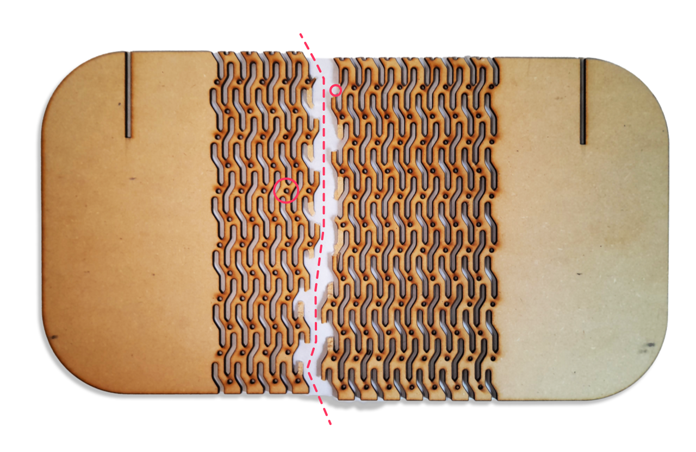

# Fabricación presencial en laboratorio

## Introducción

El miércoles 5 de junio estuve visitando el Lab en la UTEC de Durazno, donde fui el primero en realizar cortes láser. Utilicé un archivo disponible en la página del MT03. Sin embargo, durante el proceso noté que había perdido un poco de habilidad en el diseño de productos de precisión, lo que me llevó a hacer algunos ajustes en las piezas a lo largo de la jornada. Realicé estas modificaciones en un programa vectorial sin alterar el archivo final en Fusion.

## _Kerfing_ líneas de quiebre

**Primer Corte**

En el primer corte, noté varios errores en el proceso de diseño. Lo principal era comprobar si el kerfing funcionaba, pero lamentablemente, el material quedó rígido. Pensé en curvarlo con vapor de agua, pero el objetivo no era la curva en sí, sino el patrón de plegado. Por ello, tras recibir sugerencias, realicé otras pruebas.

**Segundo Corte**

Tras el error inicial, modifiqué el patrón y en este corte reduje la escala de las perforaciones a la mitad. Sin embargo, el resultado fue que el material se rompió con más facilidad que en la prueba anterior. Empecé a analizar la dirección del quiebre y deduje que los círculos entre las formas curvadas eran los responsables.

**Tercer Corte**

En esta prueba, eliminé los círculos y generé un nuevo patrón diagonal entre las formas. Sin embargo, el quiebre se produjo nuevamente porque la diagonal era contraria al eje de plegado.

**Cuarto Corte**

En esta ocasión, modifiqué la trama recordando cómo se pliega cualquier figura laminar que se desea curvar: con líneas verticales perpendiculares a la curva. Marqué aristas perpendiculares a la curva de base y generé un patrón repetitivo mucho más regular. Esta vez, funcionó correctamente.

**Corte Final**

En la prueba final, me di cuenta de que debía reducir un poco más la escala para obtener mejores resultados, y efectivamente, funcionó a la perfección.

## Espesores Insuficientes
Un problema que observé, debido a mi tendencia a ser más un diseñador conceptual que técnico, fue el uso de espesores delgados en las formas que soportan fuerzas en relación a la dureza del material. En el primer caso, la pinza que soporta dos fuerzas de presión necesitaba un mayor espesor cerca del encastre para evitar que se rompiera. Otra pieza, que actuaba como soporte para el porta lámpara, se rompió debido a la humedad ambiente, también por tener un espesor demasiado fino.

## Resultado Final
En general, el resultado final coincidió con lo que había proyectado. Los encastres funcionaron bien. Inicialmente, la holgura parecía excesiva, pero una vez que el MDF absorbió humedad del ambiente, los encastres quedaron justos.
Utilicé:

- Espesor MDF + Holgura 0.1 × 2

## Conclusión

El resultado final fue muy satisfactorio y cumplió con mis expectativas. Como prototipo experimental y ejercicio metodológico, he adquirido valiosas herramientas para futuras experimentaciones. Este proceso me ha motivado a proponer nuevos diseños utilizando técnicas similares.

En relación al kerfing, reconozco que debería haber estudiado más a fondo las referencias para evitar los errores iniciales. Este aprendizaje subraya la importancia de realizar pruebas previas de patrones, lo que permite ahorrar material y optimizar el tiempo de proceso.

Además, la experiencia de comparar lo que había diseñado en Fusion con la realidad material fue muy enriquecedora. Poder compartir con el equipo y recibir feedback fue invaluable. Realizar pruebas exhaustivas es esencial para la producción, ya que garantiza la eficiencia y la calidad del diseño final.

<iframe width="688" height="388" src="https://www.youtube.com/embed/d4SW5djXViw?si=oeFROM1EcQ1BYMG3" title="YouTube video player" frameborder="0" allow="accelerometer; autoplay; clipboard-write; encrypted-media; gyroscope; picture-in-picture; web-share" referrerpolicy="strict-origin-when-cross-origin" allowfullscreen></iframe>
