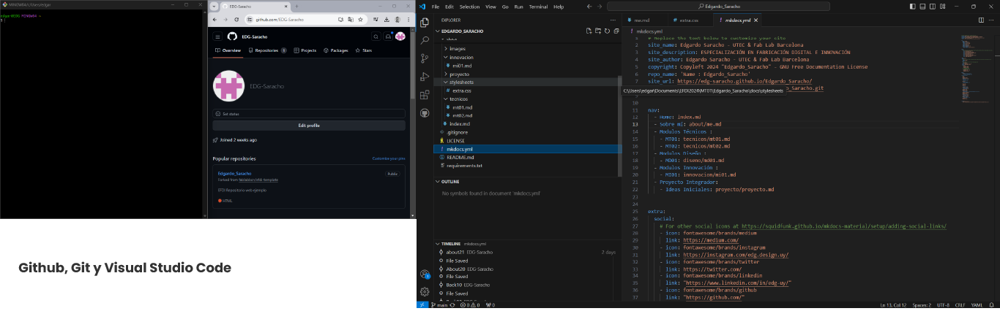
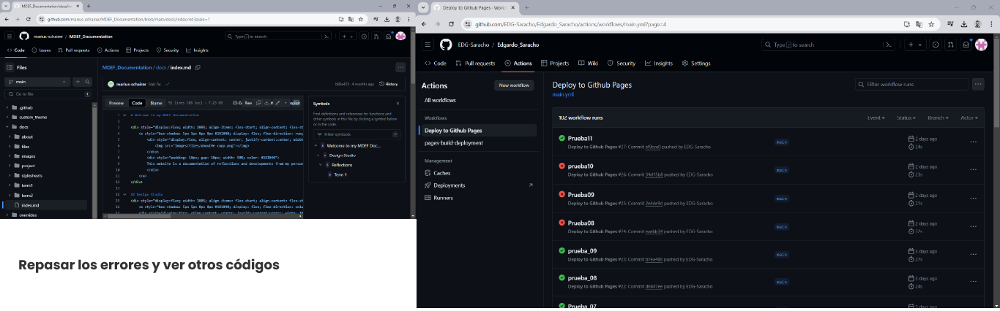
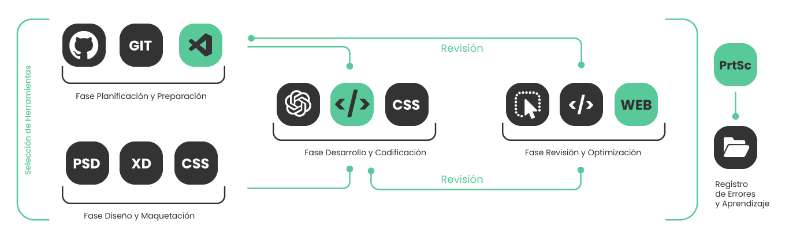

---
hide:
    - toc
---

# MT01
## Introducción a herramientas digitales 

El módulo "Introducción a Herramientas Digitales" incluyó una tarea que requería la creación de un sitio web como un repositorio para documentar el proceso a lo largo del curso. En esta sección, ofrezco un resumen detallado del desarrollo de la tarea y describo los pasos que seguí para completarla.

## 1. Github, Git y Visual Studio Code

En este paso, seguí meticulosamente los tutoriales de la plataforma. Me tomé el tiempo necesario y apliqué un consejo valioso que aprendí en mi experiencia en desarrollo web: siempre trabajar con una doble pantalla. Esto facilita la comparación de los screenshots del tutorial con lo que ocurre en el programa en uso. Aunque encontré algunos errores que no logré registrar de inmediato, pude identificarlos rápidamente gracias a esta comparación visual.

Opté por utilizar Visual Studio Code, un programa con el que ya contaba con experiencia previa en desarrollo y maquetación web. Su interfaz gráfica me resultó familiar y me ayudó a recordar el proceso de trabajo. Al principio, me familiaricé con la plantilla y el lenguaje de programación, revisando las páginas y realizando pequeños cambios al azar para observar sus efectos. Esto me llevó a realizar casi 200 commits. Posteriormente, organicé mi proceso y planifiqué cómo quería que se visualizara la página personal, incorporando mi propia identidad.

## 2. Identidad

Hace tiempo desarrollé una identidad gráfica y diseñé un sitio web que nunca llegué a completar. Pensé que sería interesante aprovechar este proyecto para rescatar ese trabajo y adaptarlo a las necesidades de la tarea. Esta decisión no solo me permitió familiarizarme con la herramienta, sino que también la hizo más amigable para mí. Además, me brindó la oportunidad de refrescar mis conocimientos en maquetación web y experimentar con Adobe XD, un programa que había estado deseando probar desde hace tiempo.

Lo que hice fue importar un screenshot de la plantilla web a una plantilla de Adobe XD. A continuación, añadí la sección de la maqueta PSD que me interesaba y utilicé las funcionalidades de demostración de XD para copiar los estilos. Posteriormente, con la ayuda de ChatGPT, codifiqué el diseño. Opté por utilizar esta IA para agilizar el proceso; de lo contrario, habría sido complicado identificar y corregir los errores que la IA misma cometía debido a problemas en el prompt.

## 3. Edición de la plantilla

Comencé a plasmar mis ideas y realicé ajustes de diseño, prestando especial atención a los detalles visuales. En un momento dado, noté que estaba generando demasiados commits para verificar cada cambio que realizaba. Recordé un truco útil para visualizar cambios, especialmente en el estilo, antes de modificar el código directamente. Inspeccioné el código en el navegador, realicé las modificaciones allí para visualizar los resultados y luego los trasladé a las páginas correspondientes. Esta metodología me permitió realizar múltiples ajustes antes de consolidarlos en un solo commit, optimizando así mi eficiencia en el proceso.

## 4. Registro del proceso

Tras la presentación de Pablo Zuloaga, adquirí una comprensión más profunda sobre la importancia de documentar meticulosamente los errores y el proceso en sí. Aunque enfrenté varios desafíos durante la familiarización con el código, algunos de los cuales habría sido útil registrar, se me pasaron inadvertidos. No obstante, estos contratiempos me permitieron optimizar mi flujo de trabajo y extraer lecciones valiosas. Además, revisé el código de otros proyectos presentados para comparar y aprender distintas formas de abordar ciertas problemáticas y estructuras de códigos.

## 5. Flujo de trabajo ideal
Como desarrollador y diseñador web metódico, una de mis fortalezas radica en la creación de procesos y metodologías de trabajo eficientes. Tras esta experiencia, reflexioné sobre cómo sería el flujo de trabajo ideal para abordar futuras tareas similares. He plasmado este flujo de trabajo de manera visual para ofrecer una estructura organizada que guíe desde la planificación inicial hasta la reflexión final. Este enfoque garantiza una implementación eficiente y fomenta un aprendizaje continuo a lo largo de todo el proyecto. A continuación, presento un resumen visual del flujo de trabajo ideal que he diseñado como referencia para futuros proyectos:

**1. Planificación y Preparación:**
   - Revisar tutoriales y definir objetivos claros.
   - Configurar estación de trabajo con herramientas adecuadas.

**2. Selección de Herramientas:**
   - Elegir el entorno de desarrollo y las herramientas gráficas.
   - Importar recursos y plantillas relevantes.

**3. Diseño y Maquetación:**
   - Integrar elementos gráficos y definir la estructura visual.
   - Utilizar herramientas como Adobe XD para prototipado.

**4. Desarrollo y Codificación:**
   - Implementar el diseño utilizando buenas prácticas de desarrollo.
   - Realizar pruebas y ajustes necesarios.

**5. Revisión y Optimización:**
   - Inspeccionar el código en el navegador para verificar cambios.
   - Consolidar ajustes y realizar commits organizados.

**6. Registro de Errores y Aprendizaje:**
   - Mantener un registro detallado de errores y soluciones.
   - Reflexionar sobre el proceso para mejorar en futuras tareas.
