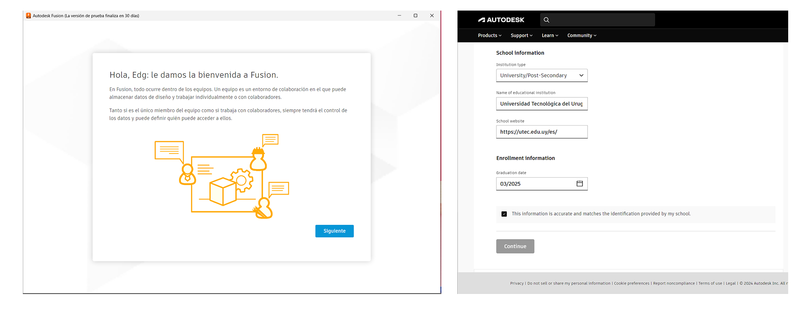
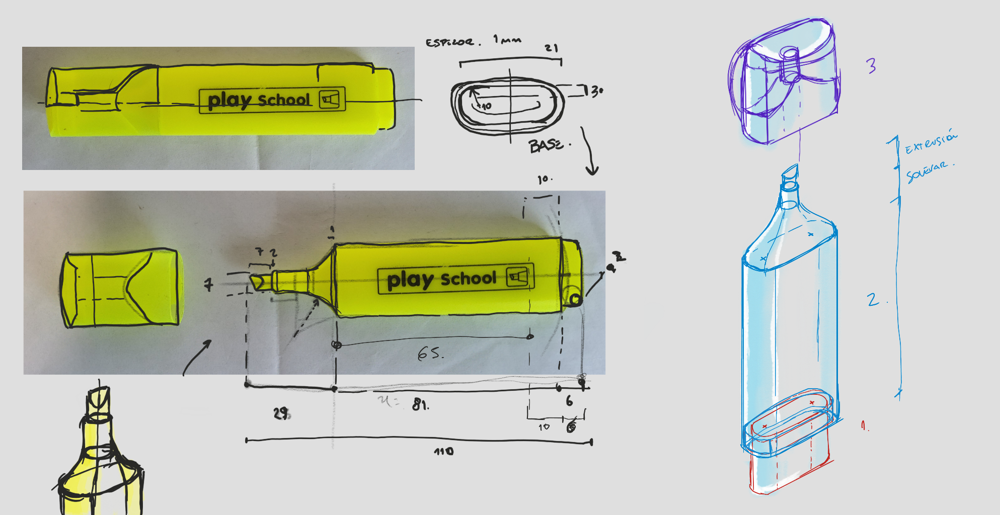
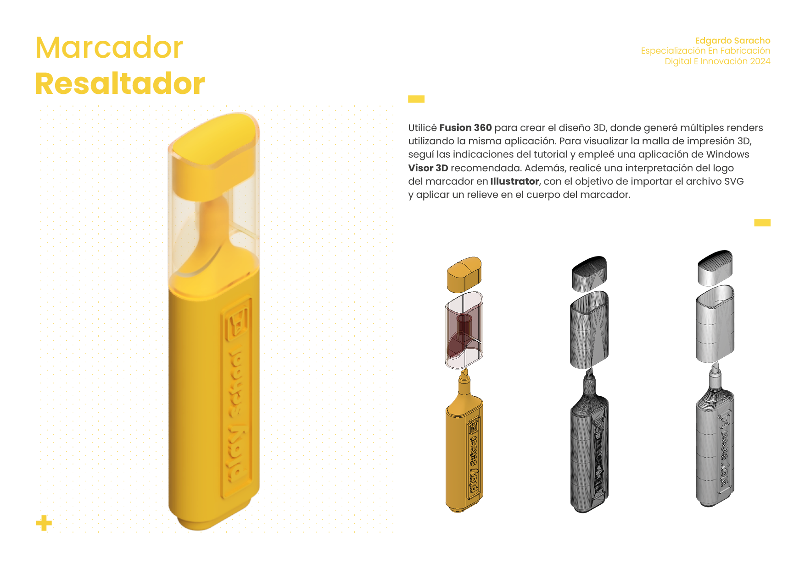
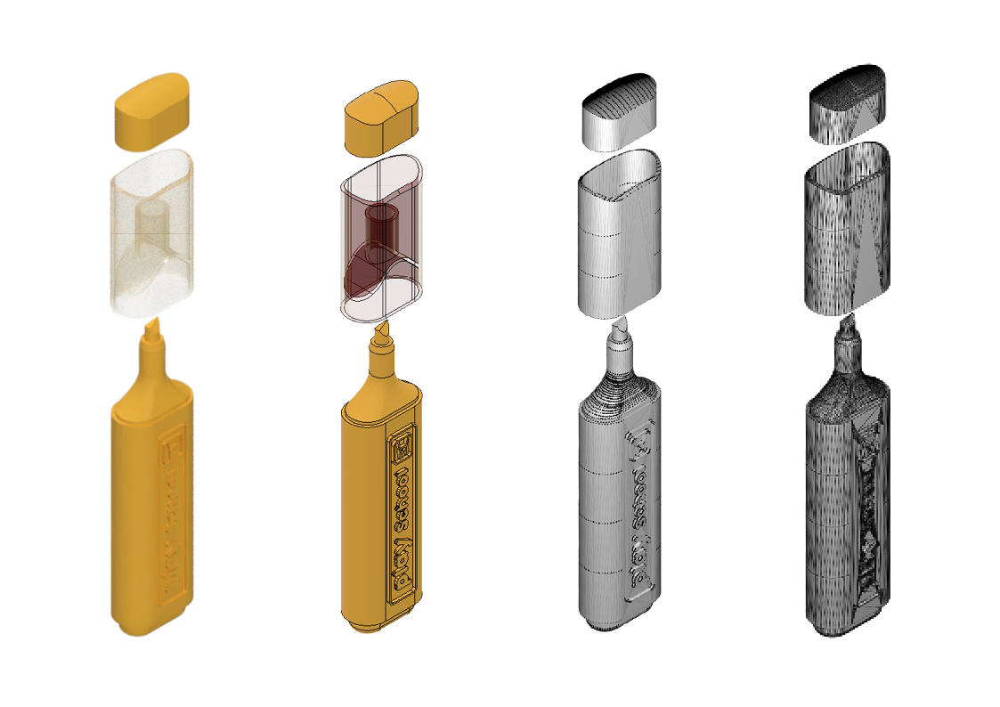
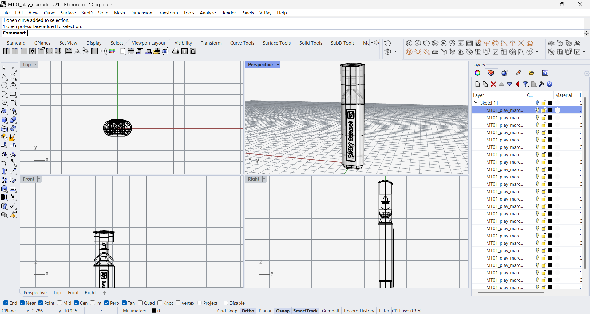
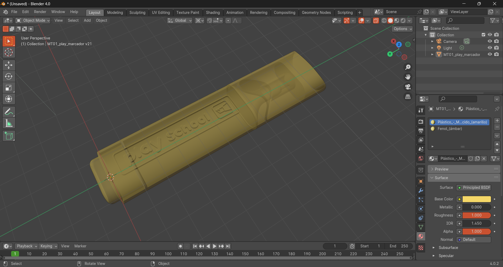

---
hide:
    - toc
---

# MT02
## Introducción a herramientas digitales 

El objetivo principal de este proyecto es adentrarse en el uso de herramientas digitales de diseño. Siendo diseñador gráfico, ya estoy familiarizado con varias de las aplicaciones presentadas en el curso. La tarea consiste en representar un objeto utilitario en 3D para familiarizarnos con una de las aplicaciones de modelado mencionadas.

## Fusion

Siguiendo las recomendaciones del profesorado, opté por explorar Fusion, un programa que he tenido interés en aprender durante un tiempo.

Experimenté algunas dificultades al intentar obtener la licencia de Fusion debido a un error en el llenado de los datos de la universidad. Para no retrasar mi progreso, decidí descargar la versión de prueba mientras buscaba una solución.

## Marcador Resaltador

**Medidas**

Opté por diseñar un marcador resaltador como proyecto. Comencé realizando un relevamiento de medidas y bocetando la estructura alámbrica para comprender las operaciones necesarias para generar el volumen. Documenté el proceso tomando fotografías y anotando las medidas, utilizando Sketchbook para el dibujo digital.

**Modelado**

Dado mi conocimiento previo de Autocad 2D y 3D, estaba familiarizado con algunos aspectos de la interfaz, aunque descubrí nuevos elementos que aún estoy explorando, así como un flujo de trabajo más eficiente.

El marcador es bastante simétrico, siendo las partes más desafiantes las puntas y ciertas áreas de la tapa. No logré resolver completamente la forma de la tapa tipo "pinza", por lo que decidí omitirla, tomando una libertad creativa. Esta parte, al ser más orgánica, requiere operaciones constructivas que aún no he dominado en Fusion.

<iframe width="688" height="388" src="https://www.youtube.com/embed/W6RaErqNkJg?si=tgT8gxMX4xvKeDqX" title="YouTube video player" frameborder="0" allow="accelerometer; autoplay; clipboard-write; encrypted-media; gyroscope; picture-in-picture; web-share" referrerpolicy="strict-origin-when-cross-origin" allowfullscreen></iframe>

**Archivo final**

Para la creación del diseño 3D, utilicé Fusion 360, donde generé múltiples renders utilizando la misma aplicación. Para visualizar la malla de impresión 3D, seguí las indicaciones del tutorial y empleé una aplicación de Windows recomendada para la visualización en 3D. Además, diseñé una interpretación del logo del marcador en Illustrator, con el propósito de importar el archivo SVG y aplicar un relieve en el cuerpo del marcador. La lámina de diseño fue elaborada en Indesign, un programa que suelo utilizar para piezas editoriales.

   **[ ⬇︎ Descargar Archivo Fusion](../Descargas/Edgardo_Saracho_MT02_modelo3D.f3d)**

## Otras pruebas

Realicé algunas pruebas adicionales para explorar la compatibilidad del archivo en otros programas que manejo, como Blender y Rhino.

**Rhino 3D:**
 Para este programa, sabía que exportando en formato .DWG sería legible. La visualización resultó satisfactoria y las mallas se mostraron bastante ordenadas. Sin embargo, encontré que la importación de polilíneas puede resultar un tanto caótica en comparación con otros objetos como se muestra en la captura de pantalla.

 

**Blender:** 
Consulté con una IA, Copilot, la extensión apropiada para Blender exportados desde Fusion y descubrí que los archivos exportados en formato .OBJ son la mejor opción. En este caso, noté que los materiales asignados en Fusion se mantuvieron, lo que facilitó la visualización y en las pruebas de renderizado se veían bien. Sin embargo, el objeto se exportó como una sola unidad, por lo que fue necesario separarlo utilizando Separate > by loose parts o by material. La complejidad de la malla podría requerir simplificación para facilitar su modificación.

 

En conclusión, tras esta experiencia con Fusion, considero que es un programa interesante que vale la pena explorar más a fondo. La interfaz gráfica me resulta más cómoda en comparación con Rhino, que cuenta con una amplia gama de herramientas que aquí están más sintetizadas. Continuaré explorando las funciones de Forms para determinar si puede ofrecer capacidades similares a las de Blender.
