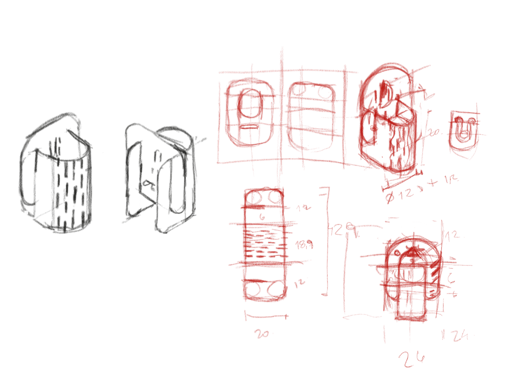
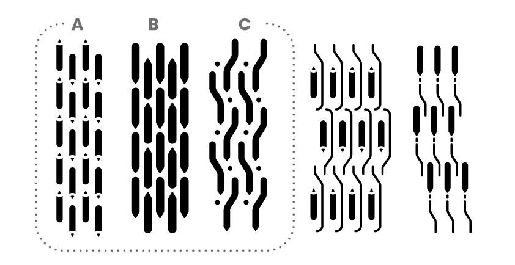
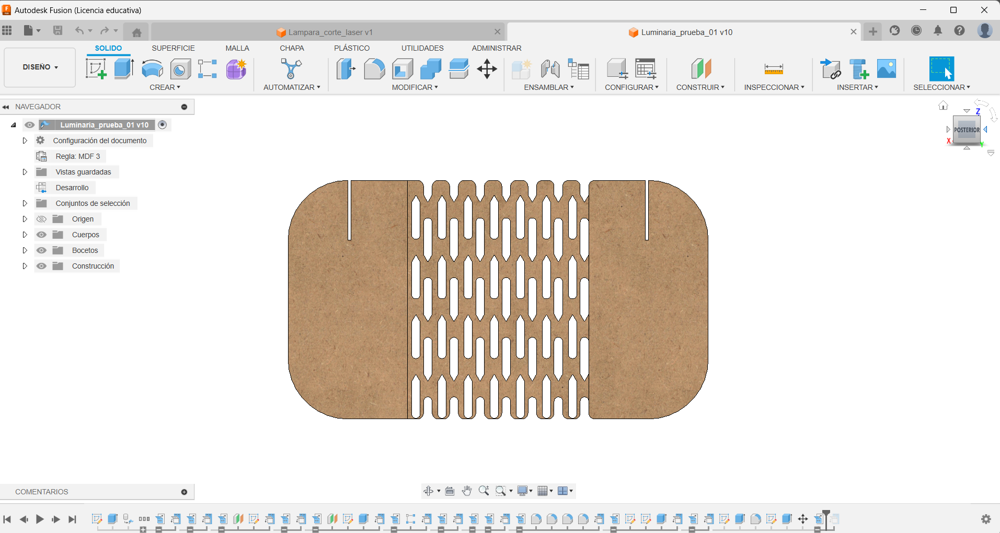
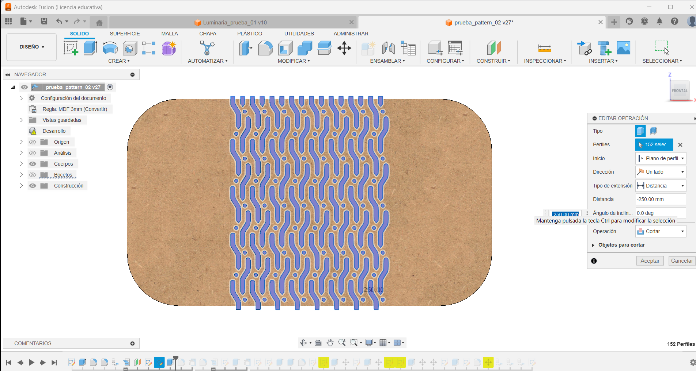
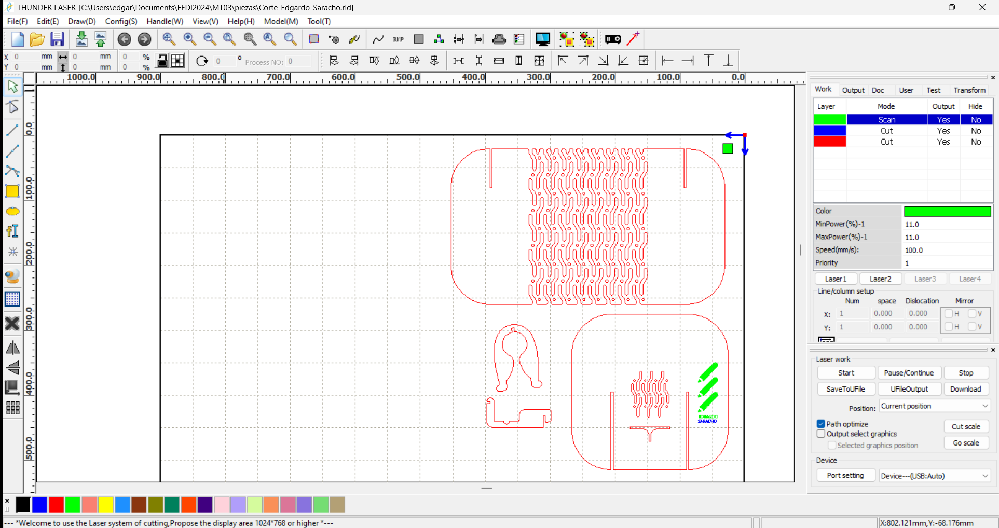

---
hide:
    - toc
---

# MT03
## Corte láser

Proceso de diseño 
Realicé varios bocetos iniciales y definí algunos requisitos clave que quería experimentar. Me propuse explorar la técnica de *kerfing* con un diseño único, diferente a los patrones comunes encontrados en las búsquedas, utilizando una ilustración de un lápiz para crear el patrón. Además, decidí incorporar una unión tipo pinza y asegurarme de que el objeto resultante fuera utilitario, específicamente una luminaria.

**Bocetos**

Realicé una breve búsqueda en Pinterest para observar los diferentes cortes de *kerfing* y los objetos que se crean utilizando esta técnica. A partir de esta investigación, comencé a esbozar mis propias ideas.

**Maqueta de control**

Utilicé sobrantes de cartón para construir una maqueta de control, lo que me permitió explorar el volumen físico del diseño. Esto me ayudó a evaluar diferentes tipos de encastres y la volumetría del objeto, acercándome a la funcionalidad que pretendo lograr.

## Modelo en Fusion 360
Para el modelo en Fusion 360, seguí las recomendaciones de los tutoriales de la plataforma. Parametricé los espesores y holguras del diseño, de modo que los encastres se ajusten adecuadamente según el espesor del MDF que utilice.

**Patrones de *Kerf* Bending**

Diseñé varios patrones de *kerfing* para evaluar su apariencia y funcionalidad. El Patrón A, que se puede ver en las imágenes, fue el primero que intenté probar en Fusion 360. Sin embargo, al utilizar la opción de curvar chapa, me dio error debido a que su forma tiende a la ruptura o impide el plegado. 

Luego probé el Patrón B, con el objetivo de experimentar con la función de patrón rectangular. Resultó ser muy difícil controlar la apariencia deseada, incluyendo la separación entre las formas y los inicios y finales del patrón. Aun así, utilicé este diseño para seguir el tutorial de cómo plegar chapa.

Finalmente, utilicé el Patrón C para el diseño final. Ajusté las medidas imprimiendo los patrones y comparándolos con la maqueta de control.

Trasladé el patrón al diseño en Fusion 360, tomando las medidas de la chapa desplegada para generar el patrón completo en Illustrator y exportarlo en formato DXF.

Tutorial de cómo visualizar  un patrón de *kerfing* en Fusion 360.

<iframe width="688" height="388" src="https://www.youtube.com/embed/RV77efTrUrw?si=W8OYEgaKS8IcojfV" title="YouTube video player" frameborder="0" allow="accelerometer; autoplay; clipboard-write; encrypted-media; gyroscope; picture-in-picture; web-share" referrerpolicy="strict-origin-when-cross-origin" allowfullscreen></iframe>

## Preparación de archivo para corte laser
Seguí las instrucciones del tutorial para cada tipo de corte y grabado, asegurándome de ajustar los parámetros según las especificaciones. Creé el archivo final en RDWorks, preparando el diseño para el proceso de corte láser.

----

**[⬇︎ Descargar Archivo FINAL](../Descargas/Corte_Edgardo_Saracho.zip)**
