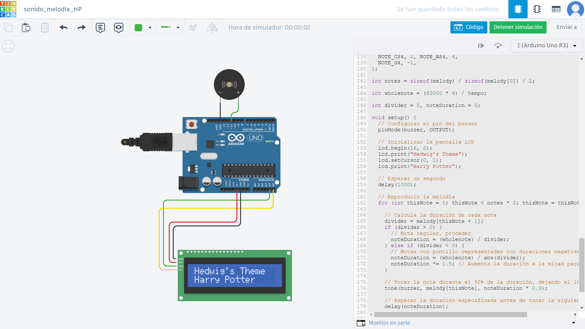
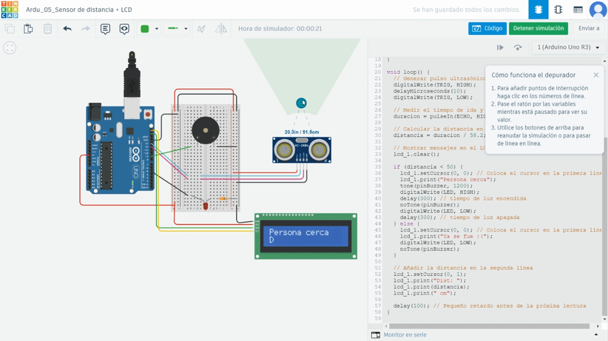
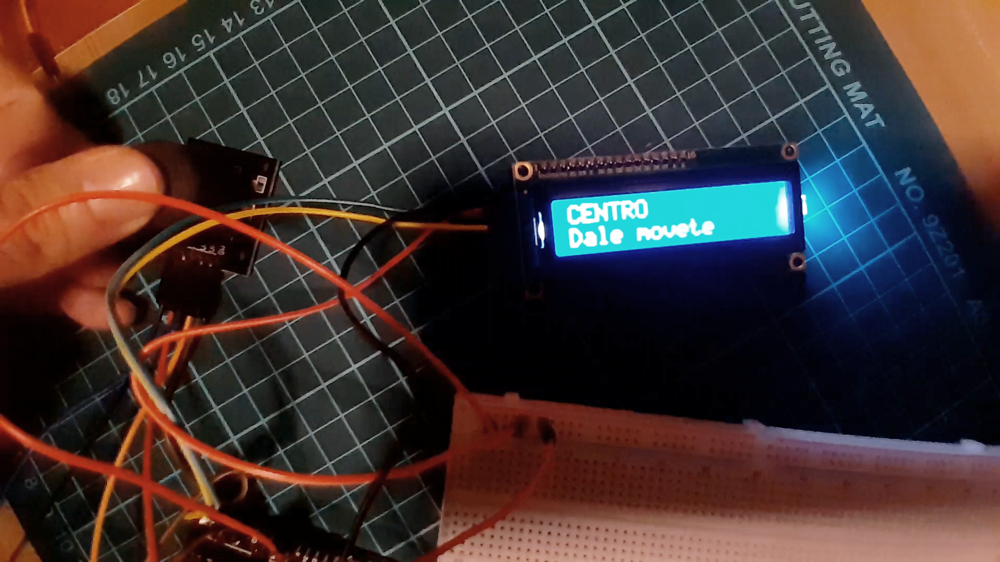

# MT04
## Introducción a la electrónica y programación (Arduino IDE)

--------
### Output (Salida)
Los pines configurados como salida se utilizan para enviar señales eléctricas desde la placa Arduino hacia otros dispositivos o componentes del proyecto. Esto permite que el Arduino controle el comportamiento de actuadores y otros elementos.

**Pruebas de salidas:**

- **LEDs:** Emiten luz cuando se les aplica voltaje. la prueba realizada fue una secuencia de luces
Tinkercad

_Pruebas en Tinkercad_ 

- **LCD + Buzzer:** Información más sonido. Busqué la melodía de Harry Potter y le puse un mensaje en la pantalla con el nombre del tema.

**Pruebas en Tinkercad*

- **Servomotor + Led:**

**Video de los Ouputs**

---------

### Input (Entrada)
Los pines configurados como entrada se utilizan para recibir información del mundo exterior hacia la placa Arduino. Estos pines leen señales eléctricas que provienen de diversos sensores o dispositivos, y luego el microcontrolador las procesa.

**Pruebas de entradas:**

- **Sensor de distancia + led + pantalla + sonido:** Miden la distancia a un objeto, muestra un mensaje y alertas de luz y sonido

_Pruebas en Tinkercad_ 

_Esquema de conexión_
<table>
    <thead>
        <tr>
            <th>Sensor Ultrasónico</th>
            <th>LED</th>
            <th>Buzzer</th>
            <th>Pantalla LCD</th>
        </tr>
    </thead>
    <tbody>
        <tr>
            <td>VCC a 5V en el Arduino</td>
            <td>Conectar el ánodo del LED al pin 5 del Arduino con una resistencia (220 ohms).</td>
            <td>Conectar el pin positivo del buzzer al pin 9 del Arduino.</td>
            <td>VCC a 5V en el Arduino (puedes usar la misma fila de alimentación en la breadboard si es necesario).</td>
        </tr>
        <tr>
            <td>GND a GND en el Arduino</td>
            <td>Conectar el cátodo del LED a GND.</td>
            <td>Conectar el pin negativo del buzzer a GND.</td>
            <td>GND a GND en el Arduino.</td>
        </tr>
        <tr>
            <td>TRIG a pin 2 en el Arduino</td>
            <td></td>
            <td></td>
            <td>SDA a SDA en el Arduino (A4 en una placa Arduino Uno).</td>
        </tr>
        <tr>
            <td>ECHO a pin 3 en el Arduino</td>
            <td></td>
            <td></td>
            <td>SCL a SCL en el Arduino (A5 en una placa Arduino Uno).</td>
        </tr>
    </tbody>
</table>
 
 -------

- **Joystick + LCD:** Detectan si han sido presionados. Muestra un mensaje en la pantalla cuando se mueve el joystick.

_Esquema de conexión_

 

<table>
    <thead>
        <tr>
            <th>LCD I2C</th>
            <th>Joystick</th>
            <th>Alimentación</th>
        </tr>
    </thead>
    <tbody>
        <tr>
            <td>VCC: Conectar a +5V de Arduino</td>
            <td>VRx (eje X): Conectar a A0 de Arduino</td>
            <td>Conectar el pin VCC del Arduino a +5V de la placa de pruebas o fuente de alimentación.</td>
        </tr>
        <tr>
            <td>GND: Conectar a GND de Arduino</td>
            <td>VRy (eje Y): Conectar a A1 de Arduino</td>
            <td>Conectar GND del Arduino a GND de la placa de pruebas o fuente de alimentación.</td>
        </tr>
        <tr>
            <td>SDA: Conectar a pin A4 (SDA) de Arduino</td>
            <td>SW (botón): Conectar a pin digital 8 de Arduino</td>
            <td></td>
        </tr>
        <tr>
            <td>SCL: Conectar a pin A5 (SCL) de Arduino</td>
            <td></td>
            <td></td>
        </tr>
    </tbody>
</table>

- **Joystick + LCD + servomotor:** Detectan si han sido presionados. Muestra un mensaje en la pantalla cuando se mueve el joystick.

_Esquema de conexión_

 <table>
        <thead>
            <tr>
                <th>Joystick</th>
                <th>LCD I2C</th>
                <th>Servo</th>
            </tr>
        </thead>
        <tbody>
            <tr>
                <td>VRx a A0</td>
                <td>SDA a A4</td>
                <td>Señal a D9</td>
            </tr>
            <tr>
                <td>VRy a A1</td>
                <td>SCL a A5</td>
                <td>VCC a 5V</td>
            </tr>
            <tr>
                <td>SW a D8</td>
                <td>GND a GND</td>
                <td>GND a GND</td>
            </tr>
            <tr>
                <td>GND a GND</td>
                <td>VCC a 5V</td>
                <td></td>
            </tr>
            <tr>
                <td>VCC a 5V</td>
                <td></td>
                <td></td>
            </tr>
        </tbody>
    </table>

**Video de los Inputs**

---------