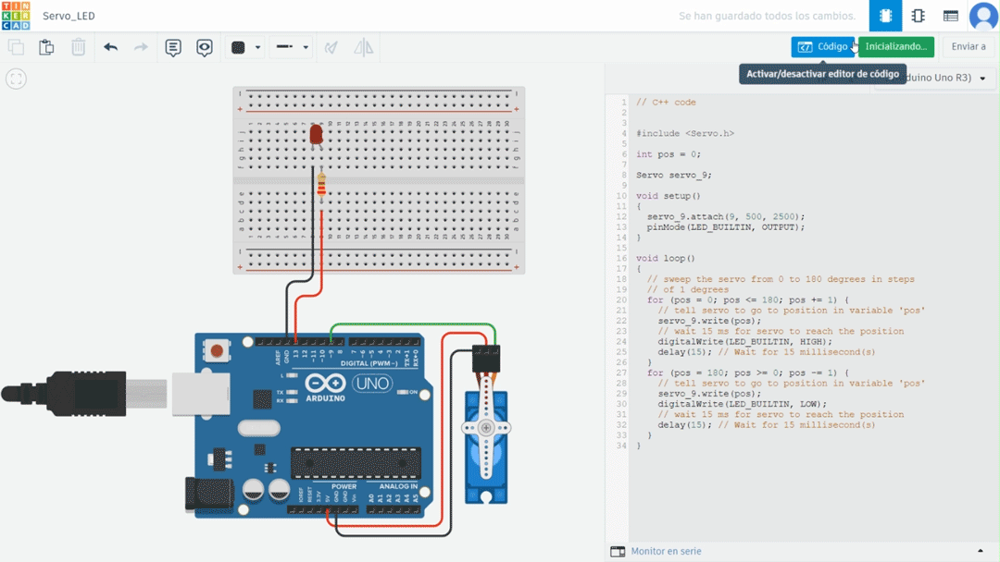
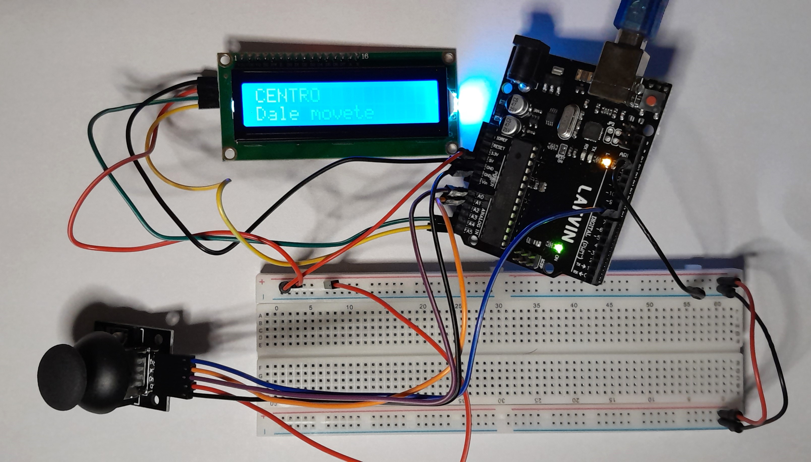
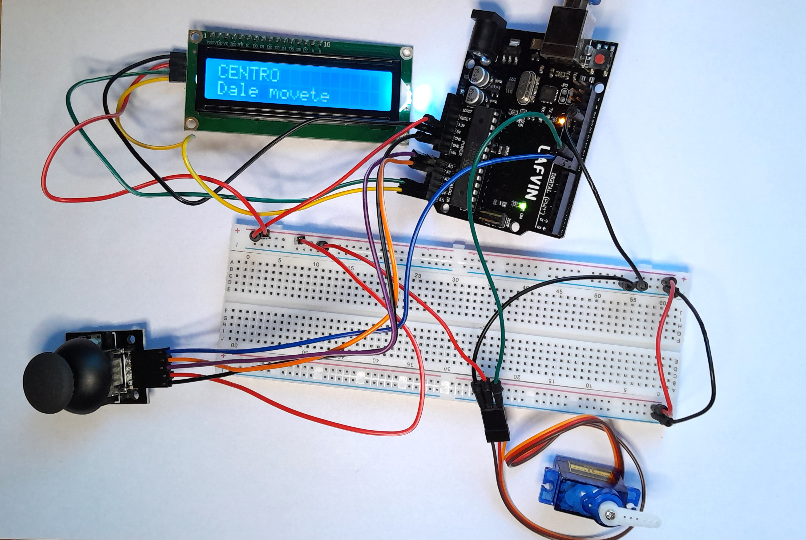

# MT04
## Introducción a la electrónica y programación (Arduino IDE)

En esta instancia, el objetivo es experimentar con *outputs* e *inputs* utilizando un kit Arduino. Al principio, debo admitir que me sentí abrumado al ver todo el contenido del kit de Arduino, pero logré superar ese pánico inicial y, sorprendentemente, me divertí en el proceso.

Mi forma de trabajar consistió en hacer pruebas preliminares en Tinkercad y ver tutoriales sobre cómo empezar con circuitos sencillos, antes de pasar a trabajar con las placas físicas. Una vez que se me ocurrieron ideas basadas en los elementos disponibles en el kit, consulté a ChatGPT sobre cómo realizarlas. Fui documentando el proceso en paralelo.

--------
## Output (Salida)
Los pines configurados como salida se utilizan para enviar señales eléctricas desde la placa Arduino hacia otros dispositivos o componentes del proyecto. Esto permite que el Arduino controle el comportamiento de actuadores y otros elementos.

### **LEDs:** 
Emiten luz cuando se les aplica voltaje. la prueba realizada fue una secuencia de luces
Tinkercad

_Pruebas en Tinkercad_ 

_Esquema de conexión_
<table>
    <thead>
        <tr>
            <th>Componente</th>
            <th>Conexión</th>
        </tr>
    </thead>
    <tbody>
        <tr>
            <td>LED Rojo</td>
            <td>Ánodo (+) a pin digital 12 del Arduino 
                Cátodo (-) a GND con resistencia de 220 ohmios
            </td>
        </tr>
        <tr>
            <td>LED Azul</td>
            <td>Ánodo (+) a pin digital 11 del Arduino 
                Cátodo (-) a GND con resistencia de 220 ohmios
            </td>
        </tr>
        <tr>
            <td>LED Naranja</td>
            <td>Ánodo (+) a pin digital 10 del Arduino 
                Cátodo (-) a GND con resistencia de 220 ohmios
            </td>
        </tr>
        <tr>
            <td>Alimentación</td>
            <td>
                Conecta los pines de 5V y GND del Arduino a las líneas correspondientes en la placa de pruebas.
            </td>
        </tr>
    </tbody>
</table>

----------

### **LCD + Buzzer:** 
Información más sonido. Busqué la melodía de Harry Potter y le puse un mensaje en la pantalla con el nombre del tema.

_Pruebas en Tinkercad_

_Esquema de conexión_
<table>
    <thead>
        <tr>
            <th>Componente</th>
            <th>Conexión</th>
        </tr>
    </thead>
    <tbody>
        <tr>
            <td>Pantalla LCD</td>
            <td>
                VCC a +5V del Arduino 
                GND a GND del Arduino 
                SDA a pin A4 (SDA) del Arduino 
                SCL a pin A5 (SCL) del Arduino
            </td>
        </tr>
        <tr>
            <td>Buzzer</td>
            <td>
                Pin positivo del buzzer a pin 9 del Arduino 
                Pin negativo del buzzer a GND del Arduino
            </td>
        </tr>
        <tr>
            <td>Alimentación</td>
            <td>
                Conecta los pines de 5V y GND del Arduino a las líneas correspondientes en la placa de pruebas.
            </td>
        </tr>
    </tbody>
</table>

----------

### **Servomotor + Led:**
Este código controla un servo y un LED utilizando un Arduino. El servo se mueve de 0 a 180 grados y de vuelta a 0 grados en pasos de 1 grado, mientras el LED integrado (conectado al pin 13) parpadea.

_Pruebas en Tinkercad_

_Esquema de conexión_
<table>
    <thead>
        <tr>
            <th>Componente</th>
            <th>Conexión</th>
        </tr>
    </thead>
    <tbody>
        <tr>
            <td>LED</td>
            <td>
                Ánodo (+) a pin digital 13 del Arduino (LED_BUILTIN) 
                Cátodo (-) a GND con resistencia de 220 ohmios
            </td>
        </tr>
        <tr>
            <td>Servo</td>
            <td>
                Señal a pin 9 del Arduino 
                VCC a 5V 
                GND a GND
            </td>
        </tr>
        <tr>
            <td>Alimentación</td>
            <td>
                Conectar los pines de 5V y GND del Arduino a las líneas correspondientes en la placa de pruebas.
            </td>
        </tr>
    </tbody>
</table>

### **Video de los Ouputs**
<iframe width="688" height="388" src="https://www.youtube.com/embed/w6mNWZRz06o?si=G0c9bjxZOjXUN4Hb" title="YouTube video player" frameborder="0" allow="accelerometer; autoplay; clipboard-write; encrypted-media; gyroscope; picture-in-picture; web-share" referrerpolicy="strict-origin-when-cross-origin" allowfullscreen></iframe>
---------

## Input (Entrada)
Los pines configurados como entrada se utilizan para recibir información del mundo exterior hacia la placa Arduino. Estos pines leen señales eléctricas que provienen de diversos sensores o dispositivos, y luego el microcontrolador las procesa.

### **Sensor de distancia + led + pantalla + sonido:** 
Miden la distancia a un objeto, muestra un mensaje y alertas de luz y sonido

_Pruebas en Tinkercad_ 

_Esquema de conexión_
<table>
    <thead>
        <tr>
            <th>Componente</th>
            <th>Conexión</th>
        </tr>
    </thead>
    <tbody>
        <tr>
            <td>Sensor Ultrasónico</td>
            <td>
                VCC a 5V en el Arduino 
                GND a GND en el Arduino 
                TRIG a pin 2 en el Arduino 
                ECHO a pin 3 en el Arduino
            </td>
        </tr>
        <tr>
            <td>LED</td>
            <td>
                Conectar el ánodo del LED al pin 5 del Arduino con una resistencia (220 ohms). 
                Conectar el cátodo del LED a GND.
            </td>
        </tr>
        <tr>
            <td>Buzzer</td>
            <td>
                Conectar el pin positivo del buzzer al pin 9 del Arduino. 
                Conectar el pin negativo del buzzer a GND.
            </td>
        </tr>
        <tr>
            <td>Pantalla LCD</td>
            <td>
                VCC a 5V en el Arduino (puedes usar la misma fila de alimentación en la breadboard si es necesario). 
                GND a GND en el Arduino. 
                SDA a SDA en el Arduino (A4 en una placa Arduino Uno). 
                SCL a SCL en el Arduino (A5 en una placa Arduino Uno).
            </td>
        </tr>
    </tbody>
</table>

 
 -------

### **Joystick + LCD:** 
Detectan si han sido presionados. Muestra un mensaje en la pantalla cuando se mueve el joystick.

_Esquema de conexión_
<table>
    <thead>
        <tr>
            <th>Componente</th>
            <th>Conexión</th>
        </tr>
    </thead>
    <tbody>
        <tr>
            <td>LCD I2C</td>
            <td>
                VCC: Conectar a +5V de Arduino 
                GND: Conectar a GND de Arduino 
                SDA: Conectar a pin A4 (SDA) de Arduino 
                SCL: Conectar a pin A5 (SCL) de Arduino
            </td>
        </tr>
        <tr>
            <td>Joystick</td>
            <td>
                VRx (eje X): Conectar a A0 de Arduino 
                VRy (eje Y): Conectar a A1 de Arduino 
                SW (botón): Conectar a pin digital 8 de Arduino
            </td>
        </tr>
        <tr>
            <td>Alimentación</td>
            <td>
                Conectar el pin VCC del Arduino a +5V de la placa de pruebas o fuente de alimentación. 
                Conectar GND del Arduino a GND de la placa de pruebas o fuente de alimentación.
            </td>
        </tr>
    </tbody>
</table>

### **Joystick + LCD + servomotor:** 
Detectan si han sido presionados. Muestra un mensaje en la pantalla cuando se mueve el joystick.

_Esquema de conexión_
 <table>
    <thead>
        <tr>
            <th>Componente</th>
            <th>Conexión</th>
        </tr>
    </thead>
    <tbody>
        <tr>
            <td>Joystick</td>
            <td>
                VRx a A0 
                VRy a A1 
                SW a D8 
                GND a GND 
                VCC a 5V
            </td>
        </tr>
        <tr>
            <td>LCD I2C</td>
            <td>
                SDA a A4 
                SCL a A5 
                GND a GND 
                VCC a 5V
            </td>
        </tr>
        <tr>
            <td>Servo</td>
            <td>
                Señal a D9 
                VCC a 5V 
                GND a GND
            </td>
        </tr>
        <tr>
            <td>Alimentación</td>
            <td>
                Conecta los pines de 5V y GND de la placa Arduino a las líneas de 5V y GND en la placa de pruebas, respectivamente, para proporcionar alimentación a todos los componentes.
            </td>
        </tr>
    </tbody>
</table>

### **Video de los Inputs**

<iframe width="688" height="388" src="https://www.youtube.com/embed/A7C19CchT3I?si=lGL8h6rdDGA6Tecd" title="YouTube video player" frameborder="0" allow="accelerometer; autoplay; clipboard-write; encrypted-media; gyroscope; picture-in-picture; web-share" referrerpolicy="strict-origin-when-cross-origin" allowfullscreen></iframe>
---------

### Links 

Valor de las resistencias:
https://uy.mouser.com/technical-resources/conversion-calculators/resistor-color-code-calculator
Tutorial Básico, que me ayudó mucho:
https://youtu.be/DDPnvmlLNq4?si=_c-rp4Q0Q6SC37II