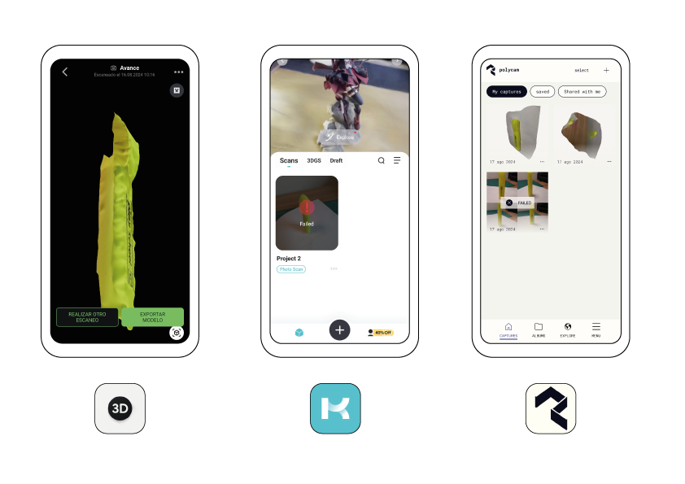
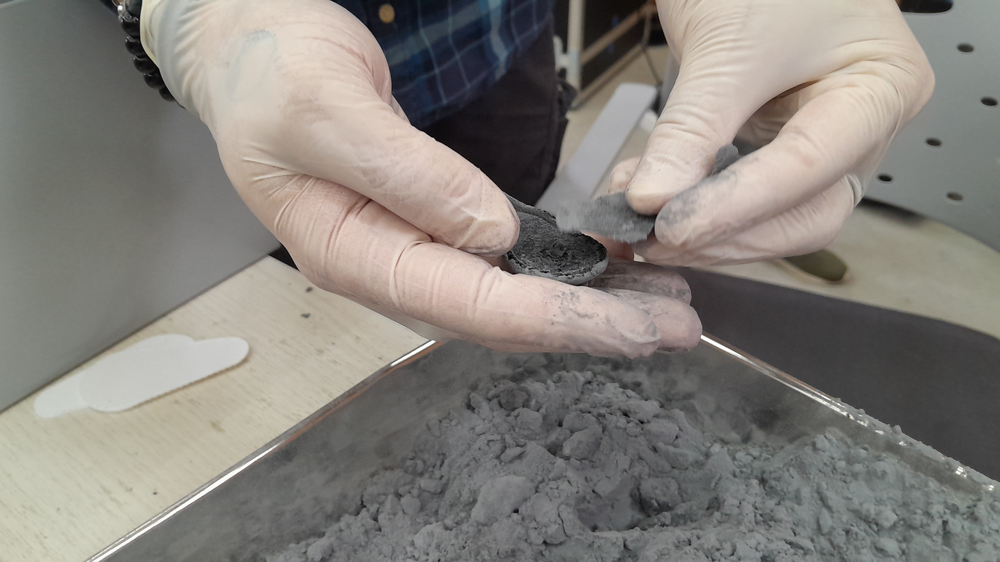
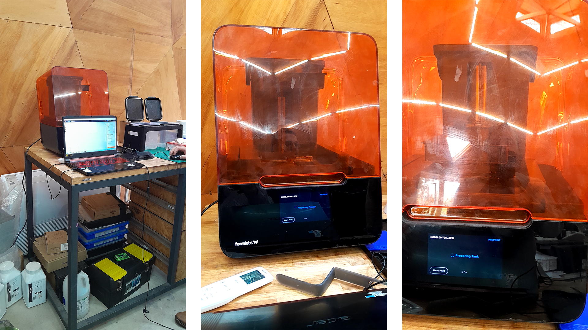
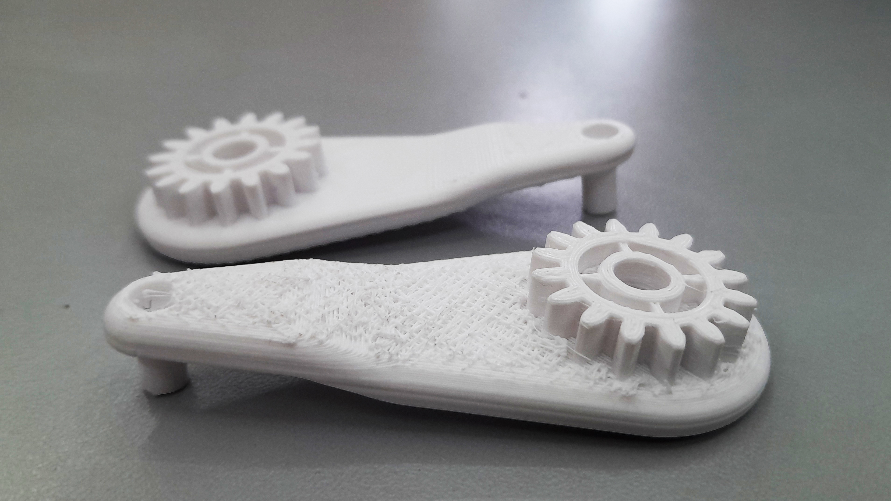

# MT05
## Impresión y escaneo 3D 

El objetivo de este módulo es experimentar con la impresión 3D. La primera parte consiste en la generación de un archivo G-code para su impresión. A partir de una pieza diseñada en Fusion 360, se pretende exportarla en formato STL y preparar el archivo G-code en el software IdeaMaker. Los pasos a seguir estaban detallados en un tutorial en la página web.

Tuve dificultades ya que la interfaz de los videos es diferente a la que me aparece en mi computadora. Algunas opciones me costó encontrarlas, pero finalmente pude hacerlo. Otra cosa que se me dificultó fue decidir la mejor orientación de la pieza en relación a los soportes. Decidí colocarla acostada en posición horizontal, porque me pareció que la resistencia iba a ser mejor. Dudé en colocarla en posición vertical con una leve rotación del eje, porque en una de las clases mencionaron que a veces era indicado, pero como no es mi campo de mayor conocimiento decidí seguir el tutorial.

### Pieza importada

### Interfase y configuración

### Pruebas de inclinación y posicionamiento

### Laminado

[⬇︎ Descargar G-code ](../Descargas/Edgardo_SARACHO.gcode)

--------------

## Escaneo 3D 

La tecnología de escaneo 3D ha avanzado significativamente en los últimos años, volviéndose cada vez más accesible gracias al uso de smartphones. Estas aplicaciones permiten capturar y reconstruir objetos del mundo real en modelos digitales tridimensionales de manera sencilla y eficiente, facilitando su uso en campos como el diseño, la arquitectura y la realidad aumentada. Sin embargo, para proyectos que requieren una mayor precisión y nivel de detalle, los equipos especializados de escaneo 3D, como escáneres láser y de luz estructurada, siguen siendo la mejor opción. Estos dispositivos ofrecen una calidad superior y son esenciales en industrias como la ingeniería, la medicina, y la conservación del patrimonio cultural, donde la exactitud es crucial. A pesar de esto, las aplicaciones móviles han democratizado el acceso a esta tecnología, permitiendo a usuarios cotidianos explorar y aplicar escaneo 3D en sus proyectos.

En mi experiencia, probé tres aplicaciones populares de escaneo 3D disponibles para dispositivos móviles después de investigar y ver varios videos en YouTube y revisar trabajos realizados por compañeros. Las aplicaciones que utilicé fueron **Polycam**, **Kiri Engine** y **Magiscan**. De estos intentos, considero que **Polycam** ofreció los mejores resultados, ya que el modelo generado fue bastante preciso y detallado. En contraste, con **Kiri Engine** y **Magiscan** enfrenté algunos desafíos relacionados con la calidad de las fotografías, la estabilidad de mi pulso al capturar las imágenes y las condiciones de iluminación, lo que afectó la precisión y calidad de los modelos obtenidos. Estas experiencias resaltan la importancia de contar con buenas condiciones de captura y familiarizarse con las herramientas para obtener resultados óptimos en el escaneo 3D con smartphones.

**Polycam, resultado**

--------------

## Laboratorio

El jueves 8 de agosto se realizó una práctica en el laboratorio donde tuvimos la oportunidad de explorar el funcionamiento de diferentes impresoras 3D y de imprimir algunas de las piezas que habíamos diseñado. Observamos el proceso de tres tipos de impresoras: **FDM (Modelado por Deposición Fundida)**, **SLS (Sinterizado Selectivo por Láser)** y **SLA (Estereolitografía)**. Aunque la experiencia fue breve, resultó muy interesante y educativa.

- **Impresoras FDM**: Estas impresoras trabajan fundiendo un filamento de material termoplástico que se deposita capa por capa para formar la pieza. Es una tecnología ampliamente utilizada debido a su accesibilidad y versatilidad, aunque puede presentar algunas limitaciones en cuanto a la precisión y el acabado superficial.

- **Impresoras SLS**: Utilizan un láser para sinterizar polvo de polímero, metal o cerámica, fusionando las partículas en una estructura sólida capa por capa. Esta tecnología es ideal para crear piezas con geometrías complejas y ofrece una excelente resistencia mecánica sin necesidad de estructuras de soporte.

- **Impresoras SLA**: Estas impresoras emplean un láser ultravioleta para solidificar una resina líquida fotosensible, creando la pieza capa por capa con gran precisión y detalle. Las impresiones SLA son conocidas por su acabado superficial liso y su capacidad para producir piezas con detalles intrincados.

Durante la práctica, también observamos cómo influye la orientación de la pieza durante la impresión, un tema que habíamos discutido en clase. Comparamos los resultados de imprimir una pieza con el engranaje orientado hacia arriba versus hacia abajo. La conclusión fue que el mejor resultado se obtuvo al imprimir con el engranaje orientado hacia arriba, lo que permitió un mejor acabado y mayor precisión en los detalles.

En las siguientes imágenes se pueden ver comparaciones de la misma pieza impresa con diferentes orientaciones, ilustrando cómo la posición afecta la calidad final de la impresión.

