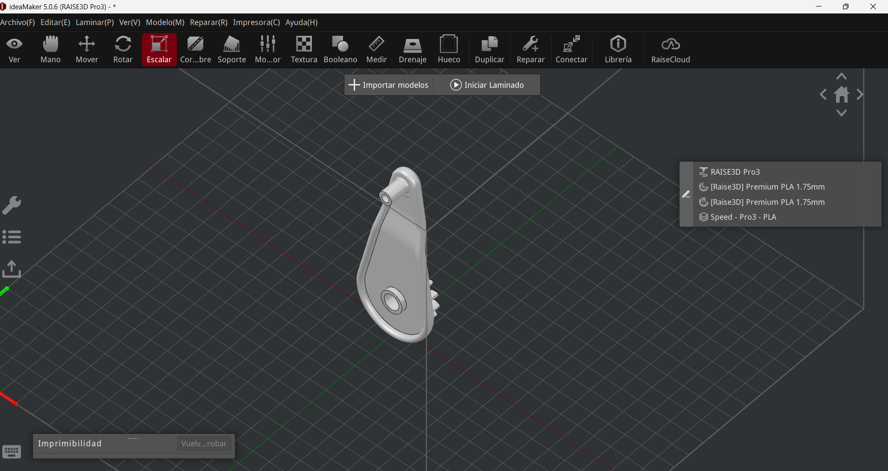
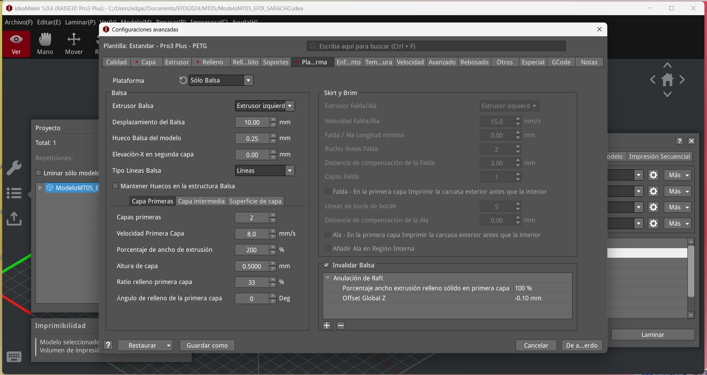
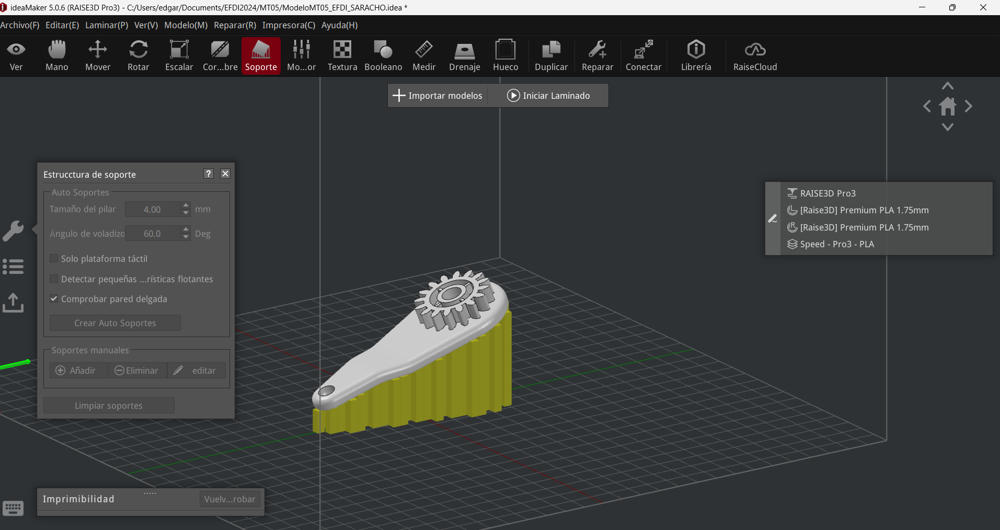
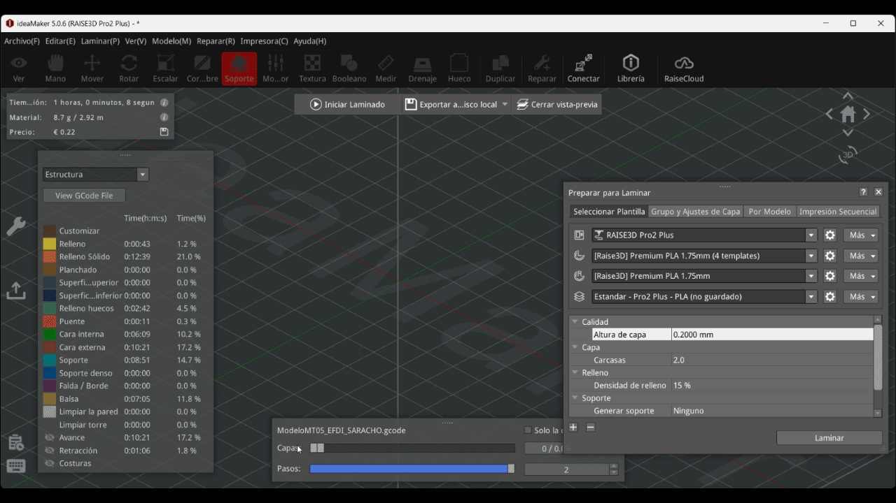

# MT05
## Impresión y escaneo 3D 

El objetivo de este módulo es experimentar con la impresión 3D. La primera parte consiste en la generación de un archivo G-code para su impresión. A partir de una pieza diseñada en Fusion 360, se pretende exportarla en formato STL y preparar el archivo G-code en el software IdeaMaker. Los pasos a seguir estaban detallados en un tutorial en la página web.

Tuve dificultades ya que la interfaz de los videos es diferente a la que me aparece en mi computadora. Algunas opciones me costó encontrarlas, pero finalmente pude hacerlo. Otra cosa que se me dificultó fue decidir la mejor orientación de la pieza en relación a los soportes. Decidí colocarla acostada en posición horizontal, porque me pareció que la resistencia iba a ser mejor. Dudé en colocarla en posición vertical con una leve rotación del eje, porque en una de las clases mencionaron que a veces era indicado, pero como no es mi campo de mayor conocimiento decidí seguir el tutorial.

### Pieza importada

### Interfase y configuración

### Pruebas de inclinación y posicionamiento

### Laminado

[⬇︎ Descargar G-code ](../Descargas/Edgardo_SARACHO.gcode)