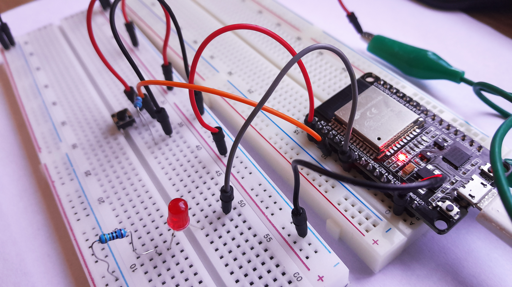
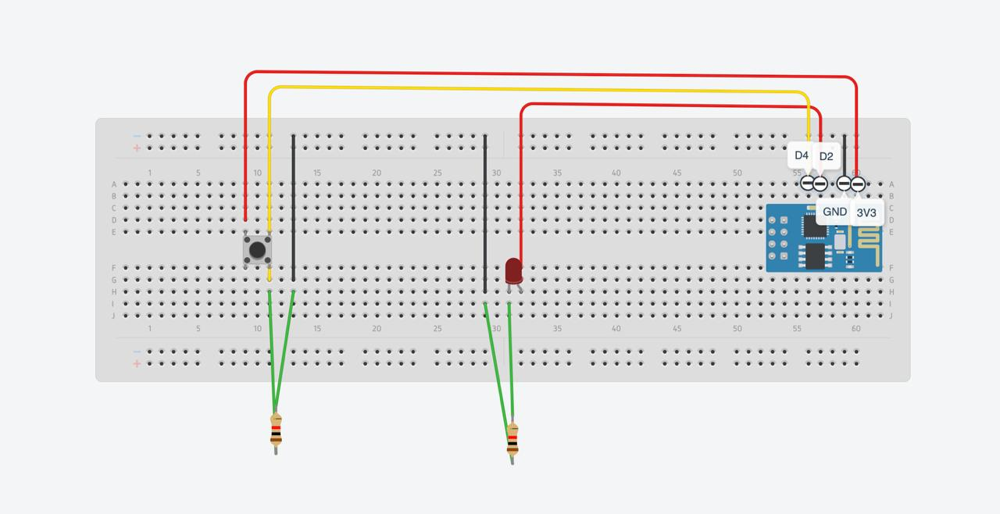
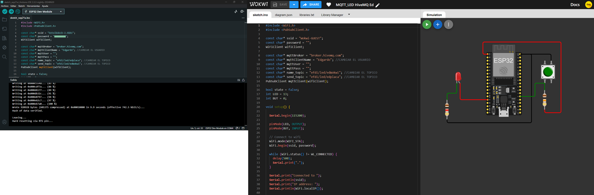
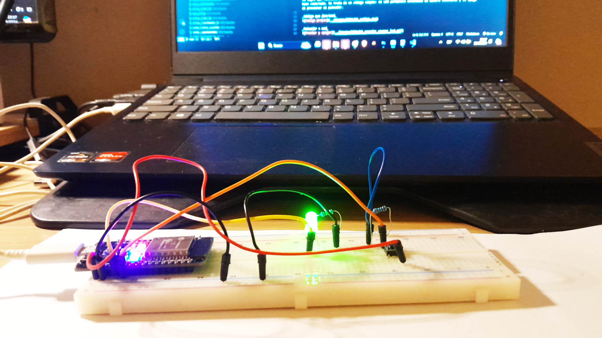
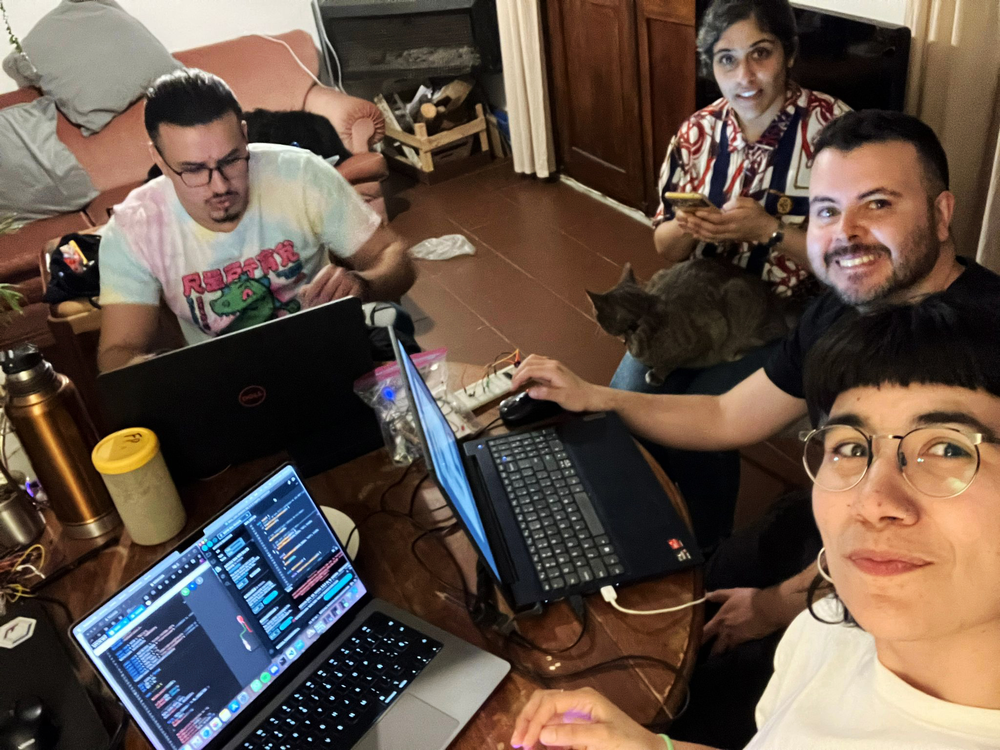

# MT06 
## Networking

El presente módulo tiene como objetivo profundizar en las capacidades de networking utilizando módulos ESP32, explorando sus posibilidades de conexión en redes de dispositivos IoT (Internet of Things). Durante este proceso, se trabajará con protocolos de comunicación como MQTT (Message Queuing Telemetry Transport), que permiten la transmisión eficiente de datos entre dispositivos en tiempo real. A través de la experimentación con módulos ESP32 físicos, los participantes aprenderán a configurar redes inalámbricas, establecer comunicaciones entre dispositivos y gestionar la transmisión de datos en diferentes aplicaciones IoT.

## Ej 1 Comunicación Serial

El proceso resultó ser bastante complejo, especialmente al intentar establecer las conexiones correctas. Realicé varias pruebas, explorando diferentes configuraciones, pero no logré una conexión adecuada hasta que, con la ayuda de un video de YouTube ([Ver video](https://youtu.be/9BxXnjHSH7s?si=HtVYPlPXvxEZL9zW)), conseguí un esquema funcional, aunque no perfecto. No fue sino hasta que nos reunimos con Franco, Victoria y Lucía que, trabajando en equipo, logramos definir correctamente el esquema de conexión.

_Primer intento de conexión_

_Esquema de conexión exitoso_

> Imagen del esquema realizada por Lucía Rossi

El código proporcionado en Wokwi no funcionaba correctamente en la placa, y después de varios intentos no logré que funcionara. Por ello, decidí escribir un código propio para verificar que todo estuviera bien conectado. Se trata de un código simple: el LED permanece encendido de manera constante y se apaga al presionar el pulsador.

_Código que funcionó_

_Pulsador + Led_

## Ej 2 Por parejas

Una vez logramos completar las conexiones, decidimos revisar nuevamente la clase grabada del jueves 19 de septiembre. Pasamos un buen rato intentando conectar Wokwi con la placa, hasta que finalmente pudimos replicar la demostración de la clase. El problema radicaba en que habíamos invertido los parámetros name_topic y send_topic. Superados estos inconvenientes, logramos hacer que la placa funcionara correctamente en red.

_Prueba en conjunto_

_Código de prueba solo_

Finalmente, conseguimos conectarnos a la placa de forma remota. En mi caso, realizamos el ejercicio junto a Franco. A continuación, comparto el enlace para controlar su placa, y en otro enlace, la mía.

**[Placa de Franco](https://wokwi.com/projects/409767097293815809)**

**[Placa de Edgardo](https://wokwi.com/projects/409681188014982145)**

---------

### Conclusiones

El proceso de establecer conexiones sin un conocimiento previo sólido resultó ser mucho más complejo de lo esperado. La falta de experiencia inicial convirtió cada intento en un desafío, ya que me enfrenté a múltiples dificultades técnicas. Sin embargo, la clase de consulta del jueves fue extremadamente necesaria. En ella se explicaron conceptos y pasos del procedimiento de programación que se asumían como conocidos, pero que, en realidad, no habían quedado del todo claros, como la instalación de librerías y la configuración necesaria para que el programa reconociera la placa, entre otros aspectos importantes.

Además, la colaboración fue esencial para lograr el éxito. De no haberme reunido un sábado en casa de Lucía para trabajar en equipo y resolver los problemas, no habría sido posible completar la tarea. Ese espacio de trabajo conjunto fue fundamental para entender las complicaciones y, finalmente, cumplir con la entrega a tiempo.

> Sábado 21 de setiembre. Franco, Victoria, Lucía y Edgardo