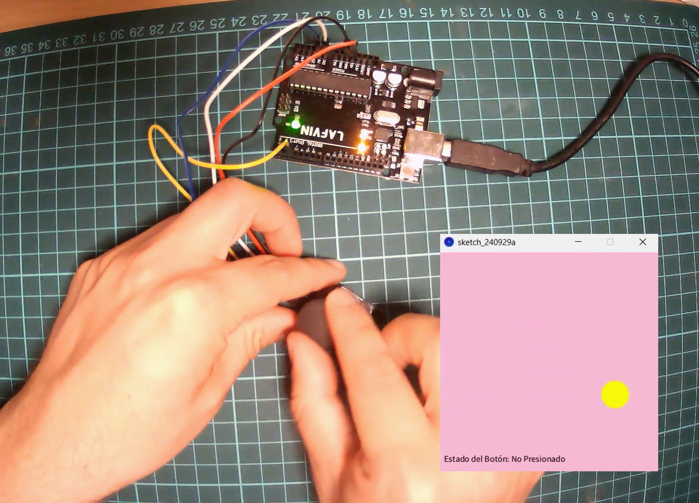
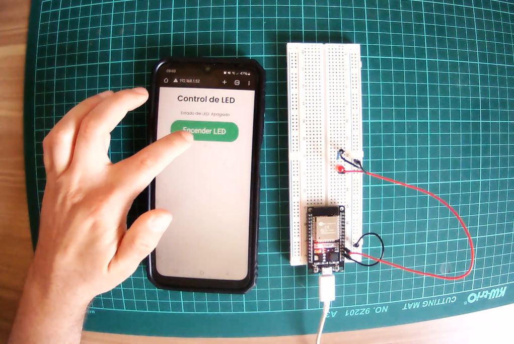
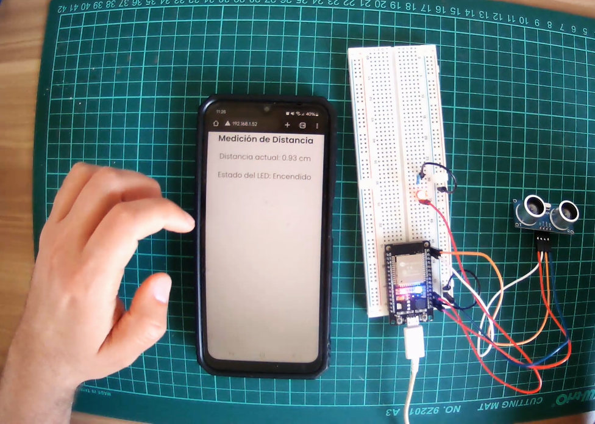
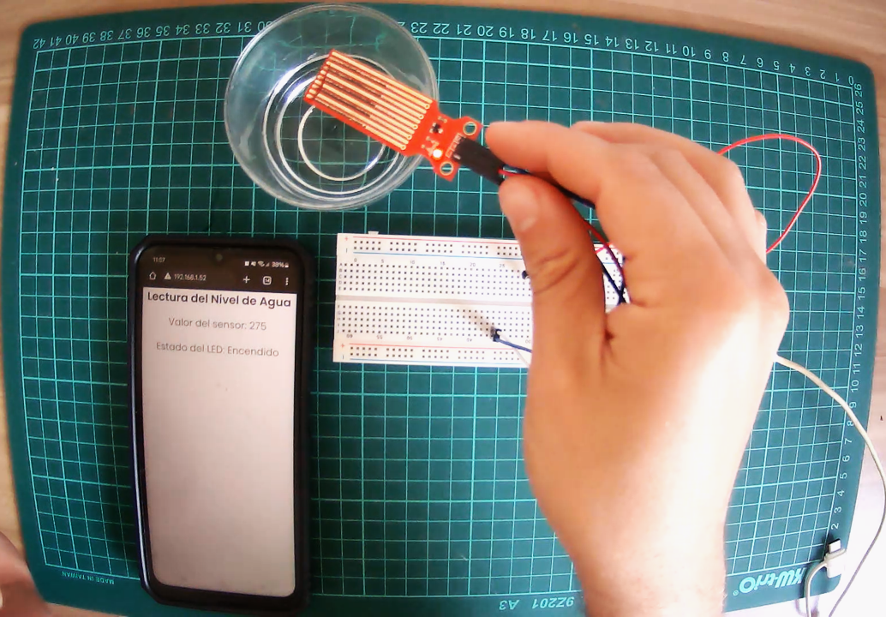

# MT07
## Diseño y desarrollo de una interfaz digital interactiva

Este ejercicio tiene como propósito desarrollar una interfaz digital que permita la interacción entre el usuario y un sistema basado en microcontroladores (Arduino y ESP32). La interfaz incluirá la lectura de datos de sensores y la manipulación de dispositivos electrónicos, con el objetivo de visualizar información en tiempo real y realizar acciones sobre componentes de hardware. Se explorarán conceptos de entrada y salida de datos (input/output), así como la comunicación entre microcontroladores y una interfaz gráfica.

## 1. Interfaz gráfica con Joystick y Arduino UNO
Se utiliza un joystick como entrada para mover un círculo en una pantalla gráfica de 400x400 píxeles. El círculo cambia de color en degrade (rojo, violeta, amarillo) a medida que se desplaza en las direcciones cardinales, manteniendo un movimiento suave. La comunicación se establece entre el Arduino y una interfaz gráfica desarrollada en Processing.

Esquema de conexión:
<table style="width: 100%;">
  <thead>
    <tr>
      <th>Componente</th>
      <th>Pin Arduino</th>
      <th>Pin del Componente</th>
    </tr>
  </thead>
  <tbody>
    <tr>
      <td>Joystick Eje X</td>
      <td>A0</td>
      <td>Eje X</td>
    </tr>
    <tr>
      <td>Joystick Eje Y</td>
      <td>A1</td>
      <td>Eje Y</td>
    </tr>
    <tr>
      <td>Joystick Botón</td>
      <td>2</td>
      <td>Botón</td>
    </tr>
    <tr>
      <td>VCC</td>
      <td>5V</td>
      <td>VCC Joystick</td>
    </tr>
    <tr>
      <td>GND</td>
      <td>GND</td>
      <td>GND Joystick</td>
    </tr>
  </tbody>
</table>

Desarrollo: La comunicación entre el joystick y la pantalla gráfica se realiza enviando los valores de los ejes X e Y del joystick al Arduino, que los transmite a Processing para controlar el movimiento del círculo en la pantalla.

 **[⬇︎ Descargar Código Arduino](../Descargas/MT07_DESCARGAS/conexion_joystick)**
 **[⬇︎ Descargar Código Processing](../Descargas/MT07_DESCARGAS/ventana_circulo_joystick.pde)**

 

-------------

## 2. Control de LED desde una página web (ESP32)
En este punto, se busca controlar el encendido y apagado de un LED a través de una interfaz web servida por la ESP32. El usuario podrá interactuar con un botón en la página web para cambiar el estado del LED.

Esquema de conexión:
<table style="width: 100%;">
  <thead>
    <tr>
      <th>Componente</th>
      <th>Pin ESP32</th>
      <th>Pin del Componente</th>
    </tr>
  </thead>
  <tbody>
    <tr>
      <td>LED</td>
      <td>D2</td>
      <td>Ánodo (+)</td>
    </tr>
    <tr>
      <td>GND</td>
      <td>GND</td>
      <td>Cátodo (-)</td>
    </tr>
  </tbody>
</table>

Desarrollo: Se configura la ESP32 para actuar como servidor web, presentando una página con un botón que envía comandos a la ESP32 para controlar el estado del LED.

**[⬇︎ Descargar Código Arduino](../Descargas/MT07_DESCARGAS/encendido_led_web)**

--------

## 3. Sensor de distancia + LED (ESP32)
El objetivo es mostrar los datos obtenidos por un sensor de distancia (HC-SR04) en una página web. Adicionalmente, se puede activar o desactivar un LED dependiendo de la distancia medida.

Utilicé como base este **[Código wokwi](https://wokwi.com/projects/343118872517280339)**. Me costó bastante lograr que funcionara correctamente, pero finalmente logré acercarme al objetivo de mostrar la distancia en pantalla.

Esquema de conexión:
<table style="width: 100%;">
  <thead>
    <tr>
      <th>Componente</th>
      <th>Pin ESP32</th>
      <th>Pin del Componente</th>
    </tr>
  </thead>
  <tbody>
    <tr>
      <td>HC-SR04 Trigger</td>
      <td>D22</td>
      <td>Trigger</td>
    </tr>
    <tr>
      <td>HC-SR04 Echo</td>
      <td>D23</td>
      <td>Echo</td>
    </tr>
    <tr>
      <td>LED</td>
      <td>D2</td>
      <td>Ánodo (+)</td>
    </tr>
    <tr>
      <td>GND</td>
      <td>GND</td>
      <td>Cátodo (-)</td>
    </tr>
    <tr>
      <td>VCC</td>
      <td>5V</td>
      <td>VCC Sensor</td>
    </tr>
  </tbody>
</table>

Desarrollo: La ESP32 lee los datos del sensor de distancia y los presenta en una interfaz web. Se puede encender o apagar el LED cuando la distancia detectada supera o cae por debajo de un umbral establecido.

**[⬇︎ Descargar Código Arduino](../Descargas/MT07_DESCARGAS/Sensor_distancia)**

-------------

## 4. Sensor de nivel de agua + LED (ESP32)
Este último ejercicio consiste en visualizar el nivel de agua en un contenedor y reflejar dicha información en una página web. El sistema también incluye un LED que puede encenderse o apagarse en función del nivel de agua medido.

Esquema de conexión:
<table style="width: 100%;">
  <thead>
    <tr>
      <th>Componente</th>
      <th>Pin ESP32</th>
      <th>Pin del Componente</th>
    </tr>
  </thead>
  <tbody>
    <tr>
      <td>Sensor de nivel</td>
      <td>D34</td>
      <td>Señal Sensor</td>
    </tr>
    <tr>
      <td>LED</td>
      <td>D2</td>
      <td>Ánodo (+)</td>
    </tr>
    <tr>
      <td>GND</td>
      <td>GND</td>
      <td>Cátodo (-)</td>
    </tr>
    <tr>
      <td>VCC</td>
      <td>5V</td>
      <td>VCC Sensor</td>
    </tr>
  </tbody>
</table>

Desarrollo: La ESP32 recibe los datos del sensor de nivel de agua y los muestra en una página web. Se puede configurar un límite para el nivel de agua, que al superarse encenderá o apagará el LED.

**[⬇︎ Descargar Código Arduino](../Descargas/MT07_DESCARGAS/niveldeagua_esp32)**

## 4.1 Sensor de nivel de agua y visualización

Se utiliza un sensor de nivel de agua conectado a un ESP32 para medir y visualizar el nivel de agua en tiempo real. A través de una interfaz gráfica en Processing, se muestra un rectángulo que cambia de color, desde celeste claro a violeta oscuro, a medida que aumenta el nivel de agua.

**[⬇︎ Descargar Código Processing](../Descargas/MT07_DESCARGAS/GRAFICA_NIVEL_AGUA.pde)**

---------

## Video

En este video se muestran las cuatro experiencias:

<iframe width="688" height="388" src="https://www.youtube.com/embed/BqAx07Z72MQ?si=9swNo9yurRLS2bQN" title="YouTube video player" frameborder="0" allow="accelerometer; autoplay; clipboard-write; encrypted-media; gyroscope; picture-in-picture; web-share" referrerpolicy="strict-origin-when-cross-origin" allowfullscreen></iframe>