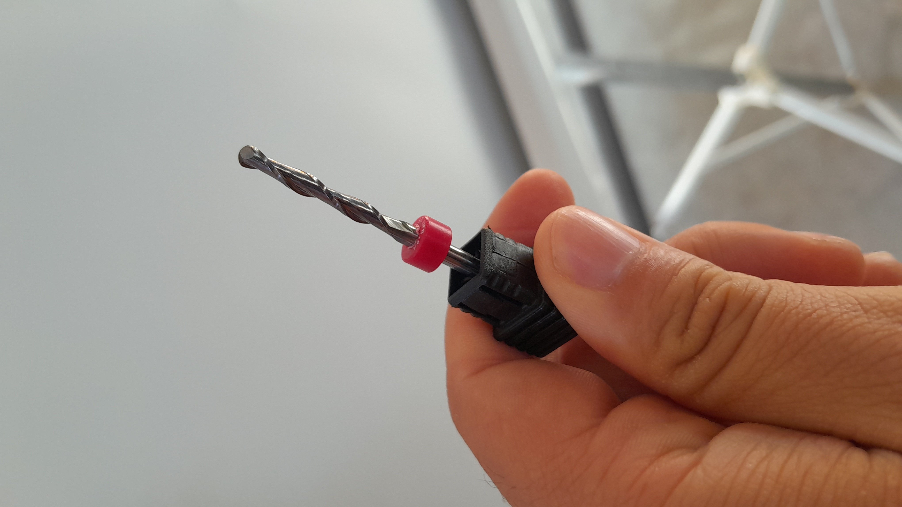
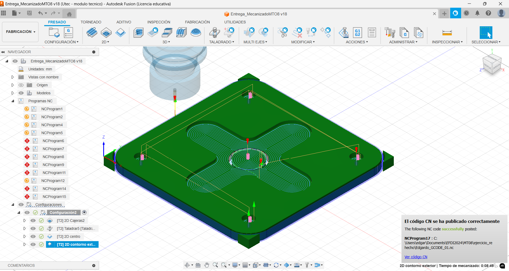

# MT08 - Control numérico computarizado (CNC)

## Módulo Fabricación Sustractiva

La tecnología CNC es un tipo de fabricación sustractiva, en la que se remueve material de un bloque inicial hasta lograr la forma deseada. Mediante el Control Numérico por Computadora (CNC), herramientas de mecanizado como fresadoras son dirigidas con instrucciones digitales para cortar, tallar y perfilar con gran precisión.

Las fresadoras CNC, máquinas clave en este proceso, emplean movimientos controlados de una herramienta de corte para trabajar materiales como madera, metal y plástico, creando piezas complejas y exactas.
Según la cantidad de ejes, los routers CNC se dividen en distintos tipos: los de 3 ejes (X, Y, Z), que trabajan en superficies planas; los de 4 ejes, que añaden un eje de rotación; y los de 5 ejes, que permiten trabajar en ángulos complejos y en tres dimensiones.

Para distintas aplicaciones, se emplean fresas específicas, o bits, cada una diseñada para diferentes acabados. Las **fresas** son herramientas afiladas de diferentes formas y metales, usadas en corte, desbaste, tallado y grabado de materiales como madera, metal y plásticos. Entre las principales, las 

**fresas planas y helicoidales** se usan para ranurados rectos y cortes planos; son económicas y simples, generalmente con dos filos, adecuadas para trabajos básicos. 

Las **fresas de bolilla** permiten ranurados en "U" y relieves 3D, brindando acabados suaves en superficies complejas. Tienen diseño helicoidal, son más costosas y detalladas, ideales para modelos tridimensionales. 
Las **fresas en "V"** se emplean para tallados precisos y grabados, con contacto mínimo sobre el material, ideales para detalles finos en superficies, aunque no son aptas para cortes profundos.

------

## Gonzalo Reiris -  Lectures & Recitations
En la clase de Lectures & Recitations, tuvimos como invitado al diseñador industrial Gonzalo Reiris, experto en moldes a gran escala y fundador del estudio de diseño GRI - Diseño en Hormigón, especializado en crear moldes con tecnología de fabricación digital. Gonzalo compartió su amplia experiencia en la industria de la construcción en Uruguay y en tecnologías de control numérico, colaborando en proyectos internacionales de gran envergadura, como estadios y terminales de aeropuertos junto al Estudio Sahadit Arquitecto en Argentina. En su taller en Solimar, ha integrado un brazo robótico de 7 ejes para tareas de fresado y, más recientemente, impresión 3D, destacando las oportunidades que ofrece la tecnología avanzada y los recursos de financiamiento estatal. Además, ha innovado en la automatización y el uso de distintos materiales, como espuma y resina, para moldes, explorando también las ventajas de reutilización y reciclaje en arquitectura.

> www.gri.com.uy
> fotos: https://www.instagram.com/gri_diseno/

Un brazo robótico de 7 ejes es una herramienta avanzada de fabricación que proporciona gran versatilidad y precisión en tareas complejas. A diferencia de los robots con menos ejes, el séptimo eje permite movimientos adicionales y mayor libertad de orientación, lo que lo hace ideal para aplicaciones que requieren alta adaptabilidad, como fresado en tres dimensiones e impresión 3D. Este tipo de robot puede trabajar en una variedad de materiales (como espuma, madera, y metales) y realizar tareas detalladas, como esculpido y tallado de moldes, con exactitud. La capacidad de integrar distintas herramientas, como cabezales de fresado y extrusores de impresión 3D, lo convierte en una opción ideal para sectores como la construcción, la arquitectura y el diseño industrial.

-------

## Objetivo del Módulo: Preparación de Piezas en Fusion 360 para Corte con Router CNC X-Carve

Este módulo tiene como propósito guiarte en la preparación de una pieza en Fusion 360, utilizando el módulo de fabricación para crear instrucciones de corte específicas para el router CNC X-Carve. La pieza, proporcionada por el equipo docente, está diseñada para emplear las principales funciones del CNC: **Cajera** para realizar el desbaste inicial, **Taladro** para ejecutar las perforaciones, y **Contorno** para efectuar el corte final de la pieza.

### Primera Entrega
En esta primera entrega, realicé todas las operaciones solicitadas en la consigna, incluidas capturas de pantalla de la pieza y las operaciones ejecutadas. Encontré varios problemas, principalmente con la orientación de la máquina, lo cual dificultaba la generación del archivo G-code (GCODE). Cuando finalmente logré exportarlo, el archivo no funcionaba correctamente, por lo que solicité asistencia docente.

Uno de los problemas surgió al utilizar la función **Taladro**, donde omití un paso clave, resultando en un mensaje de error. Este inconveniente resalta la importancia de seguir cada paso del procedimiento para evitar fallos en la configuración.

**Mensaje de error**

**Paso faltante**

Al abrir el archivo G-code en Visual Studio, me encontré con un error en la operación de **Cajera**, lo cual causó cierta confusión. A continuación, adjunto una captura de pantalla en Visual Studio, donde se muestra claramente el error:

**Error en configuración de Cajera:** No configuré correctamente la carpeta de configuraciones y en las operaciones, lo que afectó el archivo G-code.

### Segunda Entrega
Luego de que el docente identificara un error en el archivo G-code, repetí el ejercicio desde cero, siguiendo un segundo tutorial. En esta ocasión, resolví el ejercicio utilizando únicamente las funciones de **Cajera** y **Contorno**, sin aplicar la función de **Taladro**. Sin embargo, el error de orientación en el eje X persistió.

Incluyo capturas de pantalla de la pieza y las operaciones para ilustrar los pasos seguidos.

### Soluciones Implementadas
A pesar de seguir al pie de la letra ambos tutoriales, el problema radicaba en la selección incorrecta del eje X. El primer tutorial indicaba seleccionar el eje Z en la cara superior del diseño y el eje X en la cara lateral. En la última solución, solo seleccioné el eje Z y el punto de origen del material, lo cual resolvió finalmente el problema. En las capturas de pantalla incluidas, muestro la configuración correcta en el cuadro de diálogo de configuración, donde especifico estos dos puntos para todas las operaciones, obteniendo un resultado exitoso.

**Configuración**

**Resultado Exitoso 1**

**[⬇︎ Descargar G-code](../Descargas/Edgardo_Saracho.nc)**

**Resultado Exitoso 2**

**[⬇︎ Descargar G-code](../Descargas/Edgardo_Saracho.nc)**

### Conclusión:
En conclusión, considero que este método es óptimo para generar cortes de mediana escala. Estoy muy interesado en seguir profundizando en el uso de esta herramienta, ya que me gusta la carpintería amateur. Con el router CNC X-Carve, podría crear plantillas de corte, texturas en madera e incluso considerar una cadena de producción para productos con cortes sencillos.
