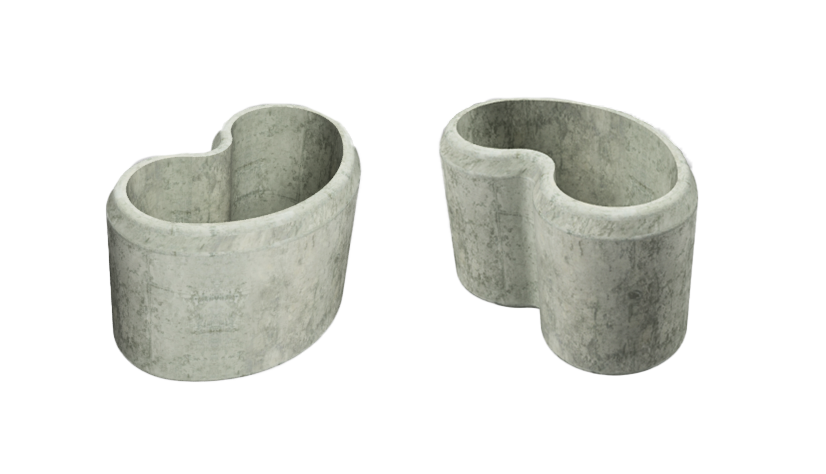
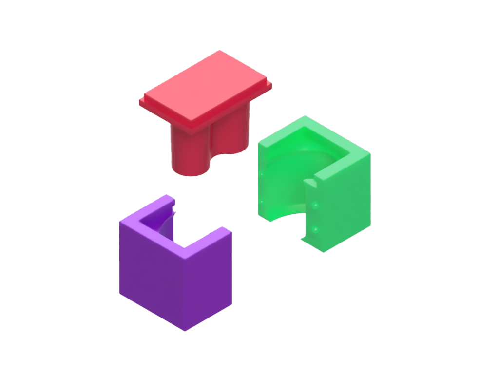
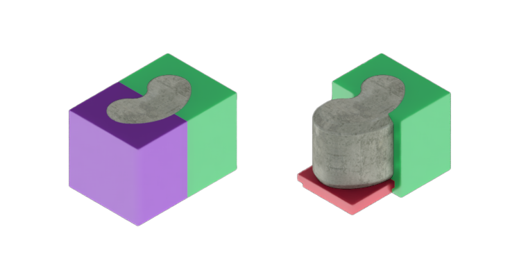
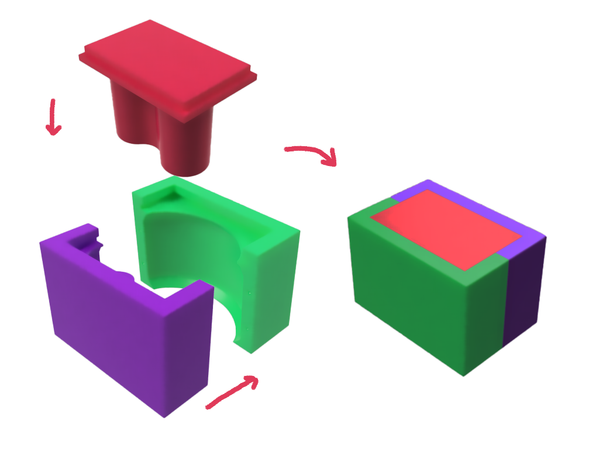
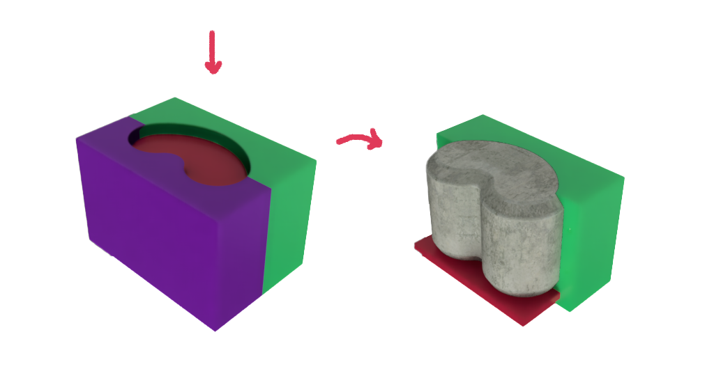

# MT09
## Diseño de Moldes mediante Fabricación Digital

Este módulo tiene como objetivo introducir al diseño de moldes utilizando técnicas de fabricación digital.La impresión 3D es una tecnología que permite crear prototipos y moldes de alta precisión de manera rápida y accesible. En el ámbito del diseño de moldes, esta tecnología facilita la iteración ágil y el ajuste de diseños para optimizar procesos de producción.

El ejercicio práctico consiste en diseñar un molde para una maceta, con un diámetro de hasta 150 mm y una altura de hasta 100 mm. A continuación, se presentan los resultados obtenidos durante el proceso de diseño utilizando el software Fusion 360.

## Modelo de maceta

En Fusion 360, diseñé una maceta sencilla empleando la herramienta "Solevar", con la intención de crear un molde dividido en tres piezas. Esta estructura modular está pensada para optimizar el proceso de fabricación y facilitar tanto el ensamblaje del molde como el desmolde de la pieza final, asegurando una mayor precisión y eficiencia en la reproducción del diseño.

## Primer Diseño del Molde: no se podrá desmoldar

Mientras trabajaba en el diseño del molde en Fusion 360, me distraje y comencé a generar las tres piezas sin darme cuenta de un detalle importante. Al final del proceso, noté que las piezas laterales del molde quedarían atrapadas debido a que se ajustaban demasiado a la curvatura de la maceta. Fue al crear el GIF del proceso de trabajo cuando me di cuenta del problema, lo que me permitió identificar esta complicación en la fase final del diseño.

### Molde fallido

-----------

## Segund Diseño del Molde: se podrá desmoldar

En el segundo diseño del molde, se ha dividido en tres partes, cada una equipada con esferas o escalones de encastre para evitar el movimiento durante el proceso. Todas las piezas presentan un ángulo cónico de desmoldeo que facilita la extracción del molde. Además, el espesor de la pared es de 20 mm, proporcionando una resistencia adecuada durante su uso.

La colada se realiza de manera invertida, de modo que la base queda hacia arriba. Como discutimos en clase, el molde debe ser compatible con una mezcla de cemento bastante líquida o con arena fina, o incluso sin arena. Para asegurar la estabilidad del molde durante el vertido, será necesario apretarlo con cinta o una goma elástica.

### Ensamble

### Colada y desmolde

